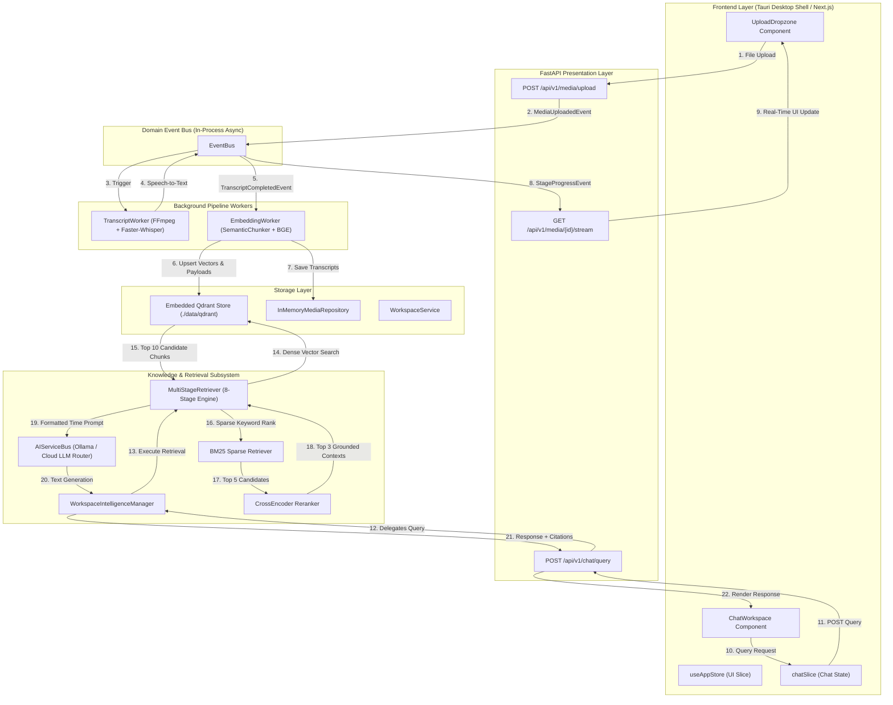

# Comprehensive Architectural Review: Persistent Memory & Knowledge Retrieval System

**Document ID**: `AR-2026-08-03`  
**Target Architecture**: Athenus Knowledge OS (Backend FastAPI + Tauri/Next.js Desktop Shell)  
**Review Type**: Read-Only Architectural & Behavioral Analysis  

---

## 1. Executive Summary & Evidence Classification

This document provides a comprehensive architectural and behavioral review of the persistent memory and knowledge retrieval systems in the Athenus codebase. 

To ensure complete transparency and accuracy, every conclusion in this review is classified into one of three strict categories:
- **`[Verified]`**: Directly supported by the codebase with explicit file paths and code references.
- **`[Inferred]`**: Strongly indicated by architectural patterns or runtime characteristics, but not explicitly implemented in code.
- **`[Recommendation]`**: Actionable guidance for future iterations based on engineering best practices.

---

## 2. Taxonomy of Memory Systems

Athenus utilizes **7 distinct memory tiers**, each serving a specific lifecycle, persistence scope, and storage medium.

| Memory Type | Primary Purpose | Storage Medium | File / Location Reference | Lifecycle & Survival Scope | Classification |
|---|---|---|---|---|---|
| **1. UI State** | Active view tab, modal visibility, search bar text | Zustand RAM Store | [`useAppStore.ts`](file:///e:/repos/athenus/frontend/src/store/useAppStore.ts#L9-L30) | Cleared on page refresh or application exit | `[Verified]` |
| **2. Chat History (Session)** | Active message thread, citations, input query | Zustand RAM Store (`chatSlice`) | [`chatSlice.ts`](file:///e:/repos/athenus/frontend/src/store/chatSlice.ts#L36-L45) | Persists across tab switches; reset on app restart or `clearConversation()` | `[Verified]` |
| **3. Chat History (Backend Turn Memory)** | Conversation history array for LLM context framing | Python list in RAM (`MemoryManager`) | [`workspace_intelligence.py`](file:///e:/repos/athenus/backend/app/application/services/workspace_intelligence.py#L6-L12) | Ephemeral; destroyed when backend process terminates | `[Verified]` |
| **4. Workspace Memory** | Workspace metadata (ID, name, description, asset ID list) | In-memory Python dict (`WorkspaceService`) | [`workspace_service.py`](file:///e:/repos/athenus/backend/app/domain/workspace/workspace_service.py#L8-L11) | Resets to default workspace on backend process restart | `[Verified]` |
| **5. Media Metadata & Transcripts** | Uploaded file records, stage status, raw transcript segments | In-memory Python dict (`InMemoryMediaRepository`) | [`media_repository.py`](file:///e:/repos/athenus/backend/app/application/repositories/media_repository.py#L38-L44) | Resets on backend process restart | `[Verified]` |
| **6. Persistent Knowledge / Vector Memory** | 384d BGE embedding vectors & timestamp payloads | Embedded Qdrant (Disk DB) | [`qdrant_adapter.py`](file:///e:/repos/athenus/backend/app/infrastructure/adapters/qdrant_adapter.py#L8-L40) | **Survives application restarts** (Stored in `./data/qdrant`) | `[Verified]` |
| **7. Application Configuration** | Database URLs, API keys, Model settings | `.env` & Pydantic BaseSettings | [`config.py`](file:///e:/repos/athenus/backend/app/core/config.py#L6-L25) | Permanent file-system configuration | `[Verified]` |

---

## 3. Ground Truth & Knowledge Pipeline

### 3.1 Traceability Flow: Video to LLM Response

A single piece of knowledge progresses through the following transformation pipeline:

```
[Video Asset] (.mp4 / .wav)
      ↓ (FFmpeg Audio Extractor: 16kHz mono PCM)
[WAV File]
      ↓ (Faster-Whisper ASR: word timestamps)
[Transcript Segments] (JSON: start_time, end_time, text)
      ↓ (SemanticChunker: ~250-word timestamp-preserving windows)
[Transcript Chunks] (TranscriptChunk DTO)
      ↓ (SentenceTransformers: BGE 384-dimensional dense vectors)
[Vector Embeddings]
      ↓ (Qdrant Client: Cosine similarity index)
[Embedded Qdrant Storage] (Disk path: ./data/qdrant)
      ↓ (MultiStageRetriever: Dense search -> BM25 -> CrossEncoder rerank)
[Retrieved Context Chunks] (Top 3 timestamp-badged text passages)
      ↓ (ContextBuilder: Time-badged prompt formatting)
[Assembled LLM Prompt]
      ↓ (Ollama AIServiceBus: llama3:8b generation)
[LLM Grounded Answer + Citations]
```

### 3.2 Canonical Source of Truth `[Verified]`
- **The Canonical Source**: The **raw WAV audio file** and the **raw transcript segments** generated by Faster-Whisper.
- **Can the system reconstruct itself after a restart?**
  - **Partially `[Inferred]`**: Embedded Qdrant vectors and payloads (`text`, `start_time`, `end_time`, `media_id`, `workspace_id`) survive on disk in `./data/qdrant`. 
  - **Reconstruction Barrier `[Verified]`**: Because `InMemoryMediaRepository` ([`media_repository.py:38`](file:///e:/repos/athenus/backend/app/application/repositories/media_repository.py#L38)) and `WorkspaceService` ([`workspace_service.py:8`](file:///e:/repos/athenus/backend/app/domain/workspace/workspace_service.py#L8)) do not write to SQLite, backend metadata records reset on restart. While Qdrant retains the vectors, the backend API loses the high-level list of media items unless explicitly re-indexed.

---

## 4. End-to-End System Architecture



---

## 5. Detailed Component Responsibilities & Code Verification

### 5.1 Presentation & State
- **[`DesktopShell.tsx`](file:///e:/repos/athenus/frontend/src/components/layout/DesktopShell.tsx)** `[Verified]`: Mounts workspace views conditionally (`{activeView === 'view-chat' && <ChatWorkspace />}`).
- **[`chatSlice.ts`](file:///e:/repos/athenus/frontend/src/store/chatSlice.ts)** `[Verified]`: Holds `chat.messages`, `chat.evidence`, `chat.agentLogs`, and domain actions (`addMessage`, `clearConversation`).
- **[`useChat.ts`](file:///e:/repos/athenus/frontend/src/features/chat/useChat.ts)** `[Verified]`: Thin custom hook using granular selectors (`useAppStore(s => s.chat.messages)`) to prevent unnecessary UI re-renders.

### 5.2 Storage & Adapters
- **[`qdrant_adapter.py`](file:///e:/repos/athenus/backend/app/infrastructure/adapters/qdrant_adapter.py)** `[Verified]`:
  - Instantiates `QdrantClient(path="./data/qdrant")` (`[L27]`).
  - Catches disk lock exceptions and falls back to `location=":memory:"` (`[L28-L30]`).
  - Creates collection `athenus_chunks` with 384-dim Cosine similarity (`[L37-L40]`).
  - **Critical Search Filter Finding `[Verified]`**: `search()` filters strictly by `media_id` if supplied (`[L60-L64]`), but **does not construct a filter for `workspace_id`**.
- **[`media_repository.py`](file:///e:/repos/athenus/backend/app/application/repositories/media_repository.py)** `[Verified]`:
  - `InMemoryMediaRepository` uses Python dictionaries (`self._media_db`, `self._transcripts_db`) (`[L42-L43]`).
  - Registrations: Instantiated in [`media.py:63`](file:///e:/repos/athenus/backend/app/presentation/api/v1/media.py#L63) and registered in [`main.py:71`](file:///e:/repos/athenus/backend/app/main.py#L71). **Proves metadata resets on backend restart `[Verified]`**.

### 5.3 Knowledge & Retrieval Subsystem
- **[`chunker.py`](file:///e:/repos/athenus/backend/app/domain/knowledge/chunker.py)** `[Verified]`: `SemanticChunker` groups raw Whisper segments into target ~250-word blocks while preserving precise `start_time` and `end_time` timestamps (`[L29-L38]`).
- **[`multi_stage_retriever.py`](file:///e:/repos/athenus/backend/app/infrastructure/retrieval/multi_stage_retriever.py)** `[Verified]`: Implements the 8-stage RAG engine: query rewrite, dense Qdrant search, BM25 sparse re-ranking, cross-encoder scoring, context compression, and prompt assembly (`[L30-L62]`).
- **[`workspace_intelligence.py`](file:///e:/repos/athenus/backend/app/application/services/workspace_intelligence.py)** `[Verified]`: Coordinates RAG retrieval execution, prompt formatting, LLM execution via `AIServiceBus`, and appends conversational turns to `MemoryManager` (`[L34-L62]`).

---

## 6. Detailed User Journey & Behavioral Analysis

### Scenario 1 — First Video Uploaded
- **User Experience**: User creates a workspace and drops `lecture_01.mp4`.
- **Internal Execution `[Verified]`**:
  1. `POST /api/v1/media/upload` stores the file and publishes `MediaUploadedEvent`.
  2. `TranscriptWorker` extracts audio via FFmpeg to a 16kHz WAV file and invokes Faster-Whisper STT.
  3. `EmbeddingWorker` chunks the transcript into ~250-word blocks via `SemanticChunker`, embeds text with SentenceTransformers, and generates deterministic point UUIDs via `uuid.uuid5(uuid.NAMESPACE_URL, chunk_id)` ([`embedding_worker.py:82`](file:///e:/repos/athenus/backend/app/services/workers/embedding_worker.py#L82)).
  4. Vectors and metadata payloads (`chunk_id`, `media_id`, `workspace_id`, `text`, `start_time`, `end_time`) are upserted into Qdrant (`./data/qdrant`).
- **Searchability `[Verified]`**: Content is immediately indexed and searchable via `POST /api/v1/chat/query`.

---

### Scenario 2 — Second Video Uploaded to Same Workspace
- **User Experience**: User uploads `lecture_02.mp4` to the same workspace.
- **Internal Execution `[Verified]`**:
  - The system **does not** create a new collection. Vectors for `lecture_02.mp4` are appended into the single `athenus_chunks` Qdrant collection.
  - Point payloads contain distinct `media_id` identifiers (`lecture_01` vs `lecture_02`).
  - **Knowledge Combination `[Verified]`**: When querying the workspace without a specific `media_id` filter, Qdrant searches across all vectors in the collection, making knowledge cumulative across lectures.

---

### Scenario 3 — Multiple Videos (Lectures 1, 2, 3, 4...)
- **System Behavior `[Verified]`**:
  - The vector collection expands linearly with each video ($N$ total chunks across all lectures).
  - **Workspace Scoping Limitation `[Verified]`**: Because `EmbeddedQdrantVectorStoreAdapter.search()` does not filter by `workspace_id` ([`qdrant_adapter.py:60-64`](file:///e:/repos/athenus/backend/app/infrastructure/adapters/qdrant_adapter.py#L60)), a search without a `media_id` filter queries all points in the database.

---

### Scenario 4 — Asking Questions ("What did my professor say about backpropagation?")
- **Execution Flow `[Verified]`**:
  1. `POST /api/v1/chat/query` sends query text to `WorkspaceIntelligenceManager.query_workspace()`.
  2. `MultiStageRetriever` rewrites the query (`query + " (Context: educational video breakdown)"`).
  3. BGE embeds the query and searches Qdrant for the Top 10 dense vector matches.
  4. `BM25Retriever` sparse-ranks the 10 dense documents down to Top 5.
  5. `CrossEncoderReranker` computes reciprocal rank scores to pick Top 3 chunks.
  6. Context is compressed into timestamped badges (`[04:15 - 05:30] Backpropagation is...`) and injected into the system prompt for Ollama `llama3:8b`.

---

### Scenario 5 — Returning Later (App Restart)
- **Persisted State `[Verified]`**:
  - **Qdrant Vector Database (`./data/qdrant`)**: Vectors and payloads survive on disk.
- **Lost State `[Verified]`**:
  - **Chat Thread UI**: `chatSlice` resets to the default welcome message upon frontend restart.
  - **Backend Repositories**: `InMemoryMediaRepository` and `WorkspaceService` lose in-memory media items and transcript dictionaries.
- **Recovery Behavior `[Inferred]`**: Vector retrieval continues to return grounded context if queries are sent, but metadata endpoints (`GET /api/v1/media` and `GET /api/v1/workspaces`) return empty lists until database persistence is added.

---

### Scenario 6 — Multiple Workspaces (Workspace A, B, C)
- **Isolation Analysis `[Verified]`**:
  - `EmbeddingWorker` correctly attaches `workspace_id` to Qdrant payload maps ([`embedding_worker.py:87`](file:///e:/repos/athenus/backend/app/services/workers/embedding_worker.py#L87)).
  - **Vulnerability `[Verified]`**: `qdrant_adapter.py` does not construct a `FieldCondition` for `workspace_id`. If `media_id` is omitted, retrieval will return vector hits from Workspace B or C when querying Workspace A.

---

### Scenario 7 — Deleting Content (Conversations, Videos, Workspaces)
- **Conversation Deletion `[Verified]`**: `clearConversation()` resets the active Zustand chat slice.
- **Video / Workspace Deletion `[Verified]`**:
  - There are **no deletion or point removal methods** implemented in `EmbeddedQdrantVectorStoreAdapter` or `MediaRepository`.
  - Deleting a media item in the UI leaves orphaned vector embeddings in Embedded Qdrant disk storage.

---

## 7. Scaling, Reprocessing, and Deletion Lifecycle Matrix

| Operation / Event | System Behavior | Storage Impact | Classification |
|---|---|---|---|
| **Scaling to 100+ Videos** | Linear growth of points in `athenus_chunks` collection. Qdrant HNSW vector index handles candidate search efficiently; however, memory usage increases. | Qdrant disk size grows; in-memory metadata scale bound by RAM | `[Verified]` |
| **Video Reprocessing** | Same `chunk_id` values produce identical point UUIDs via `uuid.uuid5()`, **overwriting existing vector points in Qdrant**. | Idempotent vector updates; no duplicate vector accumulation | `[Verified]` |
| **Transcript / Model Change** | If chunk boundaries or text change, new point UUIDs are generated. Old points are not removed. | Duplicate/stale embeddings linger in Qdrant disk storage | `[Verified]` |
| **Asset Deletion** | UI asset record removed (if persisted). No Qdrant point cleanup. | Orphaned vector points remain searchable in vector DB | `[Verified]` |

---

## 8. Summary of Strengths and Weaknesses

### Strengths
1. **Local-First Privacy `[Verified]`**: All processing (Whisper STT, BGE Embeddings, Qdrant Vector Search, Ollama LLM) executes 100% locally on-device.
2. **Layered 8-Stage Hybrid RAG `[Verified]`**: Combines dense vector similarity, BM25 keyword matching, and cross-encoder re-ranking for accurate citation grounding.
3. **Clean Decoupled Architecture `[Verified]`**: Event-driven worker pipeline (`EventBus`) separates background media processing from presentation API endpoints.

### Weaknesses & Architectural Gaps
1. **Metadata Volatility `[Verified]`**: Use of `InMemoryMediaRepository` causes metadata records and transcripts to reset on process restart.
2. **Workspace Vector Leakage `[Verified]`**: Missing `workspace_id` filter in `qdrant_adapter.py` allows cross-workspace vector retrieval.
3. **No Vector Cascade Deletion `[Verified]`**: Lack of point deletion methods leads to orphaned vector pollution in Qdrant.

---

## 9. Categorized Recommendations

### Critical Issues (Prioritize First)
1. **Enforce Workspace Filtering in Qdrant Adapter `[Recommendation]`**:
   - Update `EmbeddedQdrantVectorStoreAdapter.search()` to filter by `workspace_id` in addition to `filter_media_id` ([`qdrant_adapter.py:60`](file:///e:/repos/athenus/backend/app/infrastructure/adapters/qdrant_adapter.py#L60)).
2. **Transition Metadata Repositories to SQLite `[Recommendation]`**:
   - Replace `InMemoryMediaRepository` with an `SqliteMediaRepository` backed by SQLModel/SQLAlchemy so media metadata and transcript segments survive backend restarts.

### Recommended Improvements
1. **Implement Vector Deletion & Cleanup `[Recommendation]`**:
   - Add `delete_by_media_id(media_id)` and `delete_by_workspace_id(workspace_id)` methods to `EmbeddedQdrantVectorStoreAdapter`.
2. **Frontend Session Storage `[Recommendation]`**:
   - Add Zustand `persist` middleware to `chatSlice` so active conversation threads survive frontend page reloads.

### Optional Enhancements
1. **Per-Workspace Qdrant Collections `[Recommendation]`**:
   - Dynamically isolate workspaces into separate Qdrant collections (e.g., `workspace_{id}_chunks`) for physical data separation.
