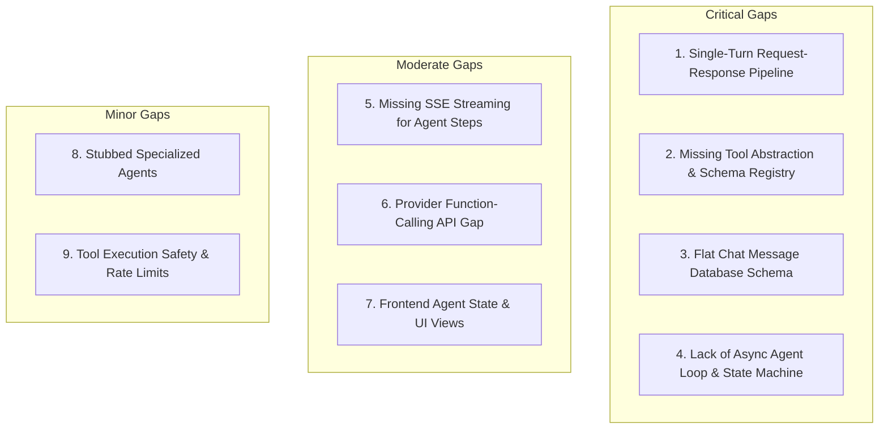
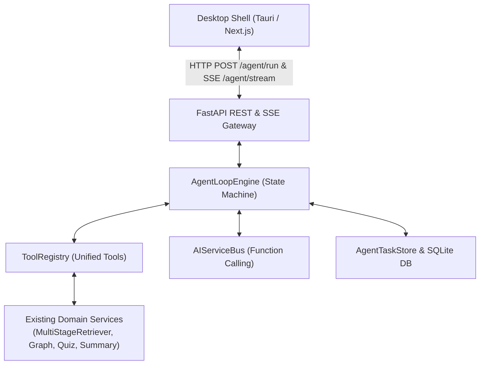
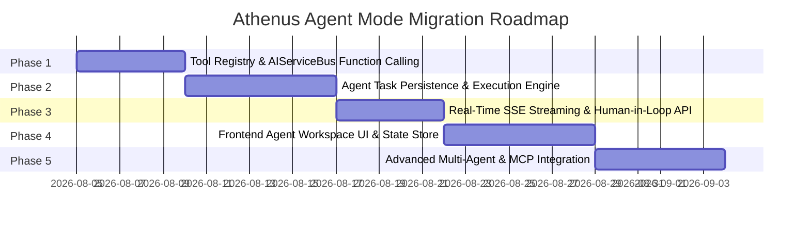

# Architectural Review & Agent Readiness Assessment: Athenus Knowledge OS

**Document Version:** 1.0.0  
**Date:** August 4, 2026  
**Status:** Completed Architectural Assessment (No Code Modifications)  
**Target Platform:** Athenus Knowledge OS (Local-First AI Learning Operating System)

---

## Executive Summary

This report delivers a comprehensive architectural review of the **Athenus Knowledge OS** codebase to evaluate its readiness for extending the current conversational RAG chatbot into an autonomous **Agent Mode**.

The evaluation demonstrates that Athenus possesses a **clean, modular, domain-driven backend foundation** with strong local-first persistence (SQLite, Embedded Qdrant), provider-agnostic abstractions (`AIServiceBus`), and rich domain capabilities (`MultiStageRetriever`, `KnowledgeGraphService`, `QuizWorker`, `FlashcardWorker`). 

However, the current execution model is **strictly single-turn and request-response bound**. It lacks an asynchronous multi-step execution loop, structured LLM function-calling capabilities, a unified Tool interface, and structured agent step persistence.

### Agent Readiness Score: 5 / 10

**Core Recommendation:** **Build Agent Mode directly on top of the existing chatbot architecture using an incremental, additive approach.** Foundational refactoring is unnecessary; the current bounded contexts, database models, and event patterns can be extended with minimal friction while retaining 100% backward compatibility with the existing chat experience.

---

## 1. Evaluation of Core Subsystems

### 1.1 Conversation Architecture

#### Current Implementation
- **Data Persistence:** Managed canonically in SQLite (`athenus.db`) via SQLModel/SQLAlchemy ORM tables: `ChatSessionTable` and `ChatMessageTable` ([models.py](file:///e:/repos/athenus/backend/app/infrastructure/db/models.py)).
- **Lifecycle & Session Scope:** Conversations belong to a `workspace_id`. Session creation is lazy (a `ChatSessionTable` row is generated on turn 1).
- **Turn Flow:** Exposed via `POST /chat/query` ([chat.py](file:///e:/repos/athenus/backend/app/presentation/api/v1/chat.py)). The user submits a query, the backend executes RAG retrieval, invokes the LLM, and calls `_persist_chat_turn()` to synchronously insert two rows (`user` message and `assistant` message with JSON citations).

#### Agent Readiness & Limitations
- **Limitations:** The storage model only accommodates flat `(sender, content, citations)` pairs. There is no concept of intermediate reasoning steps, internal thoughts (`reasoning_content`), tool invocations, tool outputs, background subtask status, or execution graphs.
- **Assessment:** Tightly coupled to standard single-turn chat. Extending to Agent Mode requires an `AgentTaskTable` and `AgentStepTable` to track multi-turn execution histories without corrupting standard chat sessions.

---

### 1.2 AI Execution Pipeline

#### Current Implementation
- **Request Flow:** `POST /chat/query` $\rightarrow$ `WorkspaceIntelligenceManager.query_workspace()` $\rightarrow$ `MultiStageRetriever.execute_retrieval()` $\rightarrow$ `AIServiceBus.get_text_capability().generate()`.
- **Retrieval Pipeline:** An 8-stage synchronous retrieval pipeline (Query rewrite $\rightarrow$ Active timestamp context extraction $\rightarrow$ Knowledge Graph traversal $\rightarrow$ Dense Qdrant + Sparse BM25 hybrid search $\rightarrow$ Cross-Encoder re-ranking $\rightarrow$ Context compression $\rightarrow$ Grounded prompt assembly).
- **LLM Invocation:** Single synchronous call to `ITextGenerationCapability.generate(TextGenerationRequest)` returning a static string response.

#### Agent Readiness & Limitations
- **Limitations:** 
  1. **Single-Turn Bound:** The pipeline assumes a single prompt generation turn per user query.
  2. **No Streaming Reasoning:** Text generation does not stream intermediate thoughts or tool calls to the client during processing.
  3. **No Dynamic Execution Loop:** Lacks an execution loop (e.g., ReAct cycle: `Thought -> Action -> Observation -> Thought -> Final Answer`).

---

### 1.3 Tooling Architecture

#### Current Implementation
- **Protocol:** `BaseAgent` protocol defines `required_tools() -> List[str]` ([agent_protocol.py](file:///e:/repos/athenus/backend/app/domain/ai/agent_protocol.py)).
- **Existing Capabilities:** High-quality domain services exist across the codebase:
  - `MultiStageRetriever` (hybrid search & re-ranking)
  - `KnowledgeGraphService` (concept prerequisite & relationship traversal)
  - `SummaryWorker` (lecture summarization)
  - `QuizWorker` (adaptive quiz generation)
  - `FlashcardWorker` (Anki SM-2 export)
  - `FFmpegAudioExtractor` / `TranscriptWorker` (audio processing)

#### Agent Readiness & Limitations
- **Limitations:** There is **no Tool abstraction layer**. Existing capabilities are standalone services rather than executable tools with schema declarations (JSON Schema / OpenAPI specs). The LLM cannot discover parameters, invoke tools, or parse structured tool outputs automatically.
- **Assessment:** A unified `ToolRegistry` wrapping existing domain services into `BaseTool` instances will immediately make 100% of existing backend capabilities agent-executable.

---

### 1.4 Workspace Model

#### Current Implementation
- **Structure:** Defined by `WorkspaceTable` in SQLite ([workspace_service.py](file:///e:/repos/athenus/backend/app/domain/workspace/workspace_service.py)). Acts as the primary container for media items, transcripts, Qdrant vectors (`filter_workspace_id`), knowledge graph concepts, flashcards, quizzes, and chat sessions.
- **Frontend Lifecycle:** Driven by Zustand `useAppStore.ts` with a deterministic 9-step workspace switching sequence ([useAppStore.ts](file:///e:/repos/athenus/frontend/src/store/useAppStore.ts#L141-L160)).

#### Agent Readiness & Limitations
- **Assessment:** Highly flexible and agent-ready. Workspaces cleanly segregate data contexts. Adding an **Agent Workspace** view in Next.js (`activeView === 'view-agent'`) and attaching agent tasks to `workspace_id` fits naturally into the existing domain hierarchy and state architecture.

---

### 1.5 State Management

#### Current Implementation
- **Backend State:** `ProgressStore` and SQLite `processing_logs` table track asynchronous video ingestion tasks via in-process domain events ([AI_PIPELINE.md](file:///e:/repos/athenus/docs/AI_PIPELINE.md)).
- **Frontend State:** Managed via Zustand (`useAppStore.ts` and `chatSlice.ts`). Tracks UI views, workspace context, input state, messages, evidence citations, and basic `agentLogs` arrays.

#### Agent Readiness & Limitations
- **Limitations:** 
  1. Backend `AgentCoordinator` is stateless and executes stubbed agents in a synchronous for-loop ([agent_coordinator.py](file:///e:/repos/athenus/backend/app/domain/ai/agent_coordinator.py)).
  2. No task state machine (`IDLE`, `PLANNING`, `EXECUTING`, `AWAITING_APPROVAL`, `COMPLETED`, `FAILED`, `CANCELLED`).
  3. No task pause/resume, cancellation token propagation, or background task queue for long-running agent workflows.

---

### 1.6 Backend Services

#### Current Implementation
- **Architecture:** Clean 7 Bounded Contexts under `backend/app/domain/` (`ai`, `knowledge`, `learning`, `media`, `settings`, `user`, `workspace`) and application services under `backend/app/application/`.
- **Modularity:** Services are decoupled, stateless, and adhere to clean interfaces (e.g. `AIServiceBus`, `SettingsService`, `SessionService`).

#### Agent Readiness & Limitations
- **Assessment:** **Exemplary.** Backend services are highly composable. An autonomous agent engine can orchestrate these services directly without code duplication.

---

### 1.7 Extensibility Assessment

| Future Capability | Current Readiness | Required Architectural Extension |
|---|---|---|
| **Multi-Step Planning** | ⚠️ Low (Stubbed) | Replace mock `PlannerAgent` with a dynamic Plan-and-Execute engine |
| **Tool Calling / Function Calling** | ❌ Missing | Add `tools` parameter support to `AIServiceBus` and JSON schema generator |
| **Background Task Execution** | ⚠️ Moderate | Adapt existing `ProgressStore` event pattern for `AgentTaskStore` |
| **Human Approval Checkpoints** | ❌ Missing | Add `AWAITING_HUMAN_APPROVAL` status to task state machine and REST endpoint |
| **Local Agents (Ollama)** | ✅ High | Ollama supports function calling; adapter requires JSON schema conversion |
| **MCP Server Integration** | ⚠️ Moderate | Add an MCP client bridge tool wrapper inside `ToolRegistry` |
| **OpenAI / Anthropic Provider APIs** | ✅ High | `AIServiceBus` already abstracts providers; requires function-calling payload mapping |

---

## 2. Agent Readiness Score Breakdown

```text
┌──────────────────────────────────────────────────────────┐
│              OVERALL AGENT READINESS SCORE               │
│                                                          │
│                      [ 5 / 10 ]                          │
└──────────────────────────────────────────────────────────┘
```

### Justification

#### Positive Factors (+5)
1. **Domain Architecture:** Excellent 7-layer bounded context structure with clear separation of domain, application, infrastructure, and presentation layers.
2. **Local-First Persistence:** Canonical relational database (SQLite) and vector store (Qdrant) supporting isolated workspace boundaries.
3. **`AIServiceBus` Abstraction:** Provider-agnostic gateway isolating LLM/STT/Embedding vendors from application code.
4. **Rich Pre-existing Domain Capabilities:** Retriever, Knowledge Graph, Quiz Generator, Summary Worker, and Flashcard Worker are production-ready.
5. **Proven Ingestion Event Pattern:** Event-driven architecture with progress streaming (`ProgressStore`) serves as an exact blueprint for agent execution streaming.

#### Negative Factors (-5)
1. **Single-Turn Request/Response Coupling:** Endpoint `/chat/query` and `WorkspaceIntelligenceManager` only support 1 turn per HTTP request.
2. **Missing Function Calling Schema:** `AIServiceBus` cannot pass tool definitions or parse LLM function calls.
3. **Flat Message Schema:** `ChatMessageTable` cannot record intermediate agent steps, thoughts, or tool executions.
4. **Mocked Agent Suite:** Existing Phase 5 agents (`PlannerAgent`, `RetrieverAgent`, `CitationValidatorAgent`) are hardcoded mocks.
5. **No Asynchronous Agent Loop Engine:** Missing state machine, task queue, cancellation controls, and SSE event streaming for agent steps.

---

## 3. Gap Analysis & Classification



### Critical Gaps (Must resolve for Agent Mode)
1. **Single-Turn Request-Response Pipeline:** `query_workspace()` returns immediately after one generation step. Agent mode requires an iterative loop (`while task_not_complete and steps < max_steps`).
2. **Missing Tool Abstraction & Schema Registry:** No unified `BaseTool` class or registry to expose domain services (retriever, graph, quiz, summary) to the LLM with typed parameters and descriptions.
3. **Flat Chat Message Database Schema:** `ChatMessageTable` stores user/assistant text pairs. Agent execution generates step logs, tool calls, tool results, and execution graphs that require dedicated relational models (`agent_tasks`, `agent_steps`).
4. **Lack of Async Agent Loop & State Machine:** No engine to manage long-running background agent execution, state transitions (`IDLE` $\rightarrow$ `PLANNING` $\rightarrow$ `EXECUTING` $\rightarrow$ `COMPLETED`), or execution cancellation.

### Moderate Gaps (Should resolve for optimal UX)
5. **Missing SSE Streaming for Agent Steps:** No Server-Sent Events endpoint to stream real-time agent thoughts, tool invocations, and subtask progress to the desktop shell.
6. **Provider Function-Calling API Gap:** `ITextGenerationCapability` interface accepts `prompt: str` without structured `tools: List[Dict]` or `tool_choice` arguments.
7. **Frontend Agent State & UI Views:** `chatSlice` and `DesktopShell` lack dedicated state management and UI components for reviewing agent execution plans, approving tool calls, and inspecting step outputs.

### Minor Gaps (Enhancements / Polish)
8. **Stubbed Specialized Agents:** Current `PlannerAgent`, `RetrieverAgent`, and `CitationValidatorAgent` return hardcoded mock dictionaries.
9. **Tool Execution Safety & Rate Limits:** Absence of execution timeout guards, tool permissions, and filesystem access sandboxing.

---

## 4. Recommended Architecture

To extend Athenus into a true **Agent Mode** while preserving 100% of existing chatbot features, we introduce four additive components:



### 4.1 Detailed Component Specifications

1. **Unified Tool Abstraction (`backend/app/domain/ai/tools/`)**
   - Define `BaseTool` protocol with `name`, `description`, `parameters_schema` (JSON Schema), and `async execute(args) -> ToolResult`.
   - Implement `ToolRegistry` to register domain services as executable tools:
     - `SearchWorkspaceTool` (wraps `MultiStageRetriever`)
     - `TraverseKnowledgeGraphTool` (wraps `KnowledgeGraphService`)
     - `GenerateQuizTool` (wraps `QuizWorker`)
     - `SummarizeContentTool` (wraps `SummaryWorker`)
     - `ExportFlashcardsTool` (wraps `FlashcardWorker`)

2. **Function-Calling Capabilities in `AIServiceBus`**
   - Extend `TextGenerationRequest` to include `tools: List[Dict[str, Any]]` and `tool_choice: Optional[str]`.
   - Update `OllamaTextGenAdapter` and `CloudTextGenAdapter` to format tools into vendor schemas (OpenAI / Anthropic / Ollama) and parse structured function calls in `TextGenerationResponse`.

3. **Asynchronous Agent Loop Engine (`AgentLoopEngine`)**
   - Executes multi-step ReAct or Plan-and-Execute cycles.
   - Manages task state transitions: `PENDING` $\rightarrow$ `PLANNING` $\rightarrow$ `EXECUTING` $\rightarrow$ `AWAITING_HUMAN_APPROVAL` $\rightarrow$ `COMPLETED` / `FAILED`.
   - Supports execution timeouts, maximum step limits, and cancellation tokens.

4. **Agent Persistence Models (`backend/app/infrastructure/db/models.py`)**
   - `AgentTaskTable`: Stores high-level task metadata (`id`, `workspace_id`, `goal`, `status`, `created_at`, `updated_at`).
   - `AgentStepTable`: Stores granular execution steps (`id`, `task_id`, `step_number`, `type` [`THOUGHT`, `TOOL_CALL`, `TOOL_RESULT`, `FINAL_ANSWER`], `content`, `tool_name`, `tool_input_json`, `tool_output_json`, `created_at`).

5. **Streaming Gateway (`POST /api/v1/agents/tasks` & `GET /api/v1/agents/tasks/{id}/stream`)**
   - Exposes asynchronous task creation and real-time SSE event streaming for live UI rendering.

6. **Frontend Agent Workspace View (`features/agent/`)**
   - Introduces `activeView === 'view-agent'` in `DesktopShell.tsx`.
   - Displays real-time step timelines, interactive tool approval modals (Human-in-the-Loop), and plan progress indicators.

---

## 5. Incremental 5-Phase Migration Plan



### Phase 1: Tool Registry & `AIServiceBus` Function Calling
- **Objective:** Establish the tool abstraction layer and enable function calling on `AIServiceBus`.
- **Scope:** Backend `domain/ai`.
- **Required Code Changes:**
  - Create `BaseTool` and `ToolRegistry` in `app/domain/ai/tools/`.
  - Wrap `MultiStageRetriever`, `KnowledgeGraphService`, `QuizWorker`, `SummaryWorker` into tools.
  - Extend `TextGenerationRequest`/`Response` to support `tools` parameter and tool calls.
  - Update `OllamaTextGenAdapter` and `CloudTextGenAdapter`.
- **Estimated Complexity:** Medium
- **Risks:** LLM output parsing instability across local Ollama models.
- **Dependencies:** None.

### Phase 2: Agent Task Persistence & Execution Engine
- **Objective:** Build backend agent task persistence and asynchronous multi-step execution loop.
- **Scope:** Backend `infrastructure/db` and `domain/ai`.
- **Required Code Changes:**
  - Add `AgentTaskTable` and `AgentStepTable` to SQLite models ([models.py](file:///e:/repos/athenus/backend/app/infrastructure/db/models.py)).
  - Implement `AgentLoopEngine` executing ReAct cycles.
  - Implement `AgentTaskStore` for SQLite persistence.
- **Estimated Complexity:** Medium-High
- **Risks:** Infinite loops in agent reasoning (mitigated by strict max step bounds).
- **Dependencies:** Phase 1.

### Phase 3: Real-Time SSE Streaming & Human-in-the-Loop API
- **Objective:** Expose agent endpoints and real-time step streaming.
- **Scope:** Backend `presentation/api/v1/agents.py`.
- **Required Code Changes:**
  - Add `POST /api/v1/agents/tasks` (create task).
  - Add `GET /api/v1/agents/tasks/{id}/stream` (SSE step progress stream).
  - Add `POST /api/v1/agents/tasks/{id}/approve` (Human approval endpoint).
  - Add `POST /api/v1/agents/tasks/{id}/cancel` (Task cancellation endpoint).
- **Estimated Complexity:** Medium
- **Risks:** Event loop blockage on Windows (mitigated by using `asyncio` queues).
- **Dependencies:** Phase 2.

### Phase 4: Frontend Agent Workspace UI & State Store
- **Objective:** Deliver interactive Agent Mode in the Tauri desktop application.
- **Scope:** Frontend `features/agent/`, `store/`, and `components/layout/`.
- **Required Code Changes:**
  - Create `agentSlice.ts` in Zustand store.
  - Create `AgentWorkspace.tsx` view with live execution timeline and tool approval modals.
  - Register `view-agent` in `DesktopShell.tsx` and `Sidebar.tsx`.
- **Estimated Complexity:** Medium
- **Risks:** UI re-render thrashing during rapid SSE streams.
- **Dependencies:** Phase 3.

### Phase 5: Advanced Multi-Agent & MCP Integration
- **Objective:** Upgrade specialized agents and enable Model Context Protocol (MCP) servers.
- **Scope:** Backend `domain/ai/agents/` and MCP tool bridge.
- **Required Code Changes:**
  - Replace stubbed `PlannerAgent`, `RetrieverAgent`, `CitationValidatorAgent` with functional agents.
  - Implement `MCPToolAdapter` to connect external MCP servers as tools in `ToolRegistry`.
- **Estimated Complexity:** High
- **Risks:** External MCP protocol latency.
- **Dependencies:** Phase 4.

---

## 6. Final Architectural Recommendation

### Recommendation: **Build ON TOP of existing chatbot architecture (Incremental Approach)**

```text
       ┌─────────────────────────────────────────────────────────┐
       │             FINAL ARCHITECTURAL DECISION                │
       ├─────────────────────────────────────────────────────────┤
       │  [X] Option A: Build ON TOP of Existing Chatbot Arch     │
       │  [ ] Option B: Build Parallel Architecture             │
       │  [ ] Option C: Perform Foundational Refactoring First   │
       └─────────────────────────────────────────────────────────┘
```

### Detailed Rationale

1. **High Code Reusability:** Athenus already possesses clean bounded contexts, modular domain services, SQLite persistence, and an established event-driven telemetry pattern (`ProgressStore`). Building a parallel framework would result in massive code duplication and fragment system state.
2. **Zero Downtime / Zero Regression:** The proposed 5-phase migration plan is purely additive. Standard single-turn chat (`POST /chat/query`) remains untouched, ensuring existing features work seamlessly while Agent Mode is introduced progressively.
3. **Natural Domain Fit:** Workspaces in Athenus already isolate media, transcripts, vectors, and knowledge graphs. Attaching `AgentTaskTable` records to `workspace_id` aligns perfectly with the existing domain hierarchy.
4. **Local-First Alignment:** The incremental design guarantees that agent execution remains 100% local-first when using local Ollama models and embedded Qdrant/SQLite stores.

---
*Report compiled following thorough analysis of the Athenus Knowledge OS codebase.*
