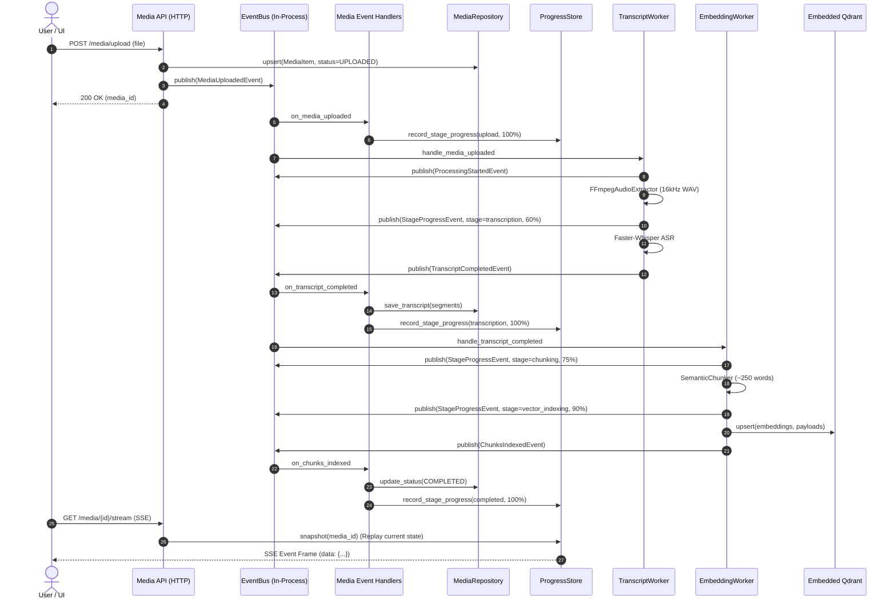

# AI_PIPELINE.md

# Athenus — AI Processing & Retrieval Pipeline

---

## Overview

The AI Engine comprises three core pipelines:
1. **Video/Audio Ingestion Pipeline**: Audio Extraction $\rightarrow$ Speech-to-Text $\rightarrow$ Semantic Chunking $\rightarrow$ Vector Indexing.
2. **Document/PDF Ingestion Pipeline**: Document Upload $\rightarrow$ AnyDoc Structure Parsing $\rightarrow$ RapidOCR ONNX Pass (Scanned Pages) $\rightarrow$ Page-Aware Semantic Chunking $\rightarrow$ Qdrant Vector Indexing.
3. **8-Stage Multi-Source Retrieval Pipeline**: Query Rewriting $\rightarrow$ Active Video/Document Context Injection $\rightarrow$ Graph Traversal $\rightarrow$ Hybrid Search $\rightarrow$ Re-Ranking $\rightarrow$ Context Compression $\rightarrow$ Grounded Multi-Source Prompt Assembly.

---

## Event-Driven Video Ingestion Pipeline



1. **Audio Extraction (`FFmpegAudioExtractor`)**: Extracts 16kHz mono WAV audio from video files (`.mp4`, `.mkv`), automatically falling back to thread-pool synchronous execution on Windows event loops.
2. **Speech-to-Text (`TranscriptWorker`)**: Uses local Faster-Whisper to produce timestamped segments `[start_time, end_time, text]`.
3. **Semantic Chunking (`SemanticChunker`)**: Groups transcript text into ~250-word chunks preserving exact `[start_time, end_time]` time bounds.
4. **Vector Embedding (`EmbeddingWorker`)**: Embeds text using SentenceTransformers (`bge-small-en-v1.5` 384-d).
5. **Vector Database (`EmbeddedQdrantVectorStoreAdapter`)**: Upserts vectors & payloads into Embedded Qdrant at `./data/qdrant` (with automatic in-memory fallback on disk storage lock contention).
6. **State Synchronization (`ProgressStore`)**: Broadcasts real-time stage progress snapshots to connecting SSE streams and REST status endpoints.

---

## 8-Stage Layered Retrieval Pipeline (`MultiStageRetriever`)

```text
Query ──► [1. Query Rewrite] ──► [2. Intent Detection] ──► [3. Context Injection]
                                                                  │
[6. Re-Ranking] ◄── [5. Hybrid Search (Vector+BM25)] ◄── [4. Graph Traversal]
       │
       ▼
[7. Context Compression] ──► [8. Grounded Prompt Assembly] ──► AI Service Bus
```

1. **Query Rewrite & HyDE**: Reformulates user questions for higher semantic recall.
2. **Intent Detection**: Identifies whether the user is seeking timestamp lookup, explanation, quiz, or summary.
3. **Workspace Context Injection**: Attaches active workspace & media ID parameters.
4. **Knowledge Graph Traversal**: Traverses prerequisite nodes for conceptual context.
5. **Hybrid Search**: Merges Dense Vector Search (Qdrant Cosine similarity) with Sparse Keyword Search (`BM25Retriever`).
6. **Cross-Encoder Re-Ranking**: Scores top-$N$ candidate chunks using `CrossEncoderReranker`.
7. **Context Compression**: Removes redundant sentences while retaining exact timestamp bounds `[MM:SS - MM:SS]`.
8. **Grounded Prompt Assembly**: Formulates grounded prompt to `ITextGenerationCapability` (Ollama) enforcing timestamp citations.
