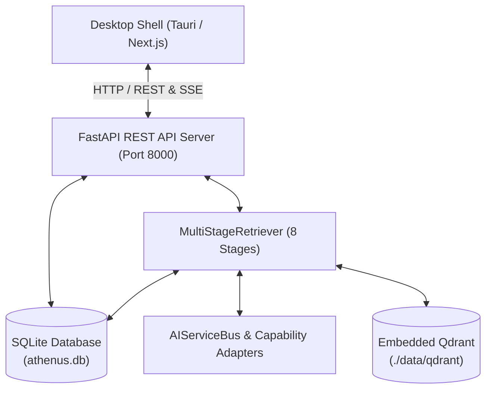
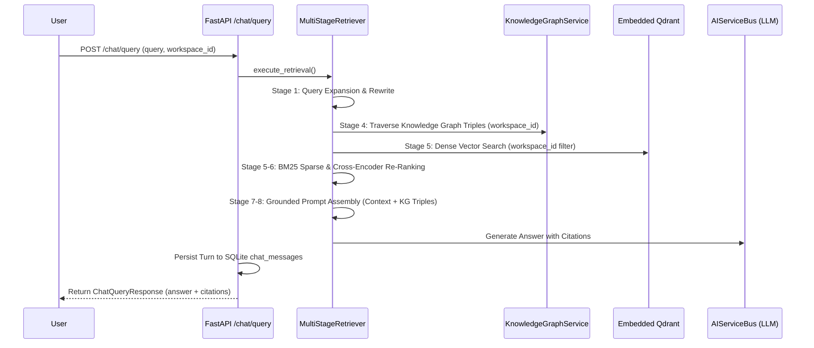

# ARCHITECTURE.md — Athenus Knowledge OS Master Architecture Specification

This document serves as the canonical source of truth for the **Athenus Knowledge OS** architecture, design decisions, data flows, and subsystem boundaries.

---

## 1. System Overview & Core Principles

Athenus Knowledge OS is a **local-first, offline-capable learning operating system** designed to transform video/audio lecture content into an interactive, grounded AI learning assistant.

### 5 Core Design Principles
1. **Local-First & Offline-Capable**: Full functionality (database, vector search, ASR, RAG retrieval) runs on the user's desktop without requiring internet access.
2. **Provider-Agnostic AI Bus**: Core business logic interacts with LLM, Embedding, and ASR capabilities via abstract capability interfaces (`AIServiceBus`).
3. **Canonical Relational Metadata Store**: All system state (workspaces, media items, transcripts, chat history, ingestion audit logs, concept graphs) is stored canonically in **SQLite** (`./data/athenus.db`).
4. **Strict Workspace Isolation**: Retrieval operations scope vector searches, BM25 rankers, and knowledge graph traversals strictly to the active workspace.
5. **Observed & Observable AI Systems**: Every ingestion step and RAG retrieval turn is observable via persistent audit logs and clickable timestamp citations.

---

## 2. High-Level Architecture Topology

---

## 3. Component Ownership & Subsystem Boundaries

### 3.1 Presentation Layer (`frontend/` & `backend/app/presentation/api/v1/`)
- **Desktop Shell**: Tauri + Next.js 14 + Vanilla CSS + Zustand.
- **REST Endpoints**:
  - `media.py`: Asset upload, SSE stage progress streaming, file serving, history telemetry audit log.
  - `chat.py`: RAG question-answering (`POST /chat/query`), conversation history restoration (`GET /chat/history`), and chat clearing (`DELETE /chat/history`).
  - `workspaces.py`: Workspace lifecycle management.

### 3.2 Application Services & Event Bus (`backend/app/application/`)
- **`WorkspaceIntelligenceManager`**: Coordinates retrieval and text generation via `AIServiceBus`.
- **`ProgressStore` & `media_event_handlers.py`**: Intercepts domain events (`ProcessingStartedEvent`, `StageProgressEvent`, `TranscriptCompletedEvent`, `ChunksIndexedEvent`) and writes immutable telemetry rows to SQLite `processing_logs` table.

### 3.3 Domain Layer (`backend/app/domain/`)
- **`AIServiceBus`**: Abstract routing layer decoupling LLMs (`MockOllamaAdapter`), Embedding Models (`SentenceTransformersEmbeddingAdapter`), and Whisper ASR.
- **`WorkspaceService`**: Workspace domain model backed by SQLite persistence.
- **`KnowledgeGraphService`**: Concept node and edge graph traversal backed by SQLite (`knowledge_concepts`, `knowledge_relations`).

### 3.4 Infrastructure Layer (`backend/app/infrastructure/`)
- **SQLite Database (`session.py` & `models.py`)**: Canonical relational store managing 9 SQLModel / SQLAlchemy ORM tables (`workspaces`, `media_items`, `transcript_chunks`, `transcript_segments`, `chat_sessions`, `chat_messages`, `processing_logs`, `knowledge_concepts`, `knowledge_relations`).
- **`SqliteMediaRepository`**: Persistent implementation of `MediaRepository` contract.
- **`EmbeddedQdrantVectorStoreAdapter`**: Local vector store using 384-dimensional cosine embeddings with payload `workspace_id` filtering.

---

## 4. Multi-Stage RAG Retrieval Pipeline (8 Stages)

---

## 5. Architectural Decision Records (ADRs) Summary

| ADR | Title | Key Decision |
|---|---|---|
| **[ADR 0001](file:///e:/repos/athenus/docs/adr/0001-sqlite-canonical-metadata-persistence.md)** | SQLite Canonical Metadata Persistence | Replaced volatile in-memory dictionary maps with SQLite (`./data/athenus.db`) for all metadata and conversation state. |
| **[ADR 0002](file:///e:/repos/athenus/docs/adr/0002-workspace-isolated-vector-retrieval.md)** | Workspace-Isolated Vector Retrieval | Implemented mandatory Qdrant payload filtering (`filter_workspace_id`) to prevent cross-workspace vector leakage. |
| **[ADR 0003](file:///e:/repos/athenus/docs/adr/0003-unified-ingestion-stage-audit-logging.md)** | Ingestion Audit Logging | Added `ProcessingLogTable` in SQLite to record timestamped ingestion telemetry accessible via `GET /media/{id}/history`. |
| **[ADR 0004](file:///e:/repos/athenus/docs/adr/0004-persistent-knowledge-graph-and-conversational-memory.md)** | Persistent Knowledge Graph & Memory | Stored concept nodes and relation triples in SQLite, expanded RAG prompts with Stage 4 graph triples, and added `DELETE /chat/history`. |

---

## 6. Known Limitations & Technical Debt

1. **ASR Execution Speed**: Faster-Whisper CPU execution for long 2-hour lecture videos can take several minutes.
2. **Single-User Desktop Model**: SQLite single-writer model limits concurrency to single desktop user (intentional design choice for offline Knowledge OS).
3. **Advanced Graph Entity Extraction**: Domain concept extraction currently relies on rule-based heuristics and chunk-level entity extraction workers; LLM-based entity-relation extraction is planned for Phase 5.
