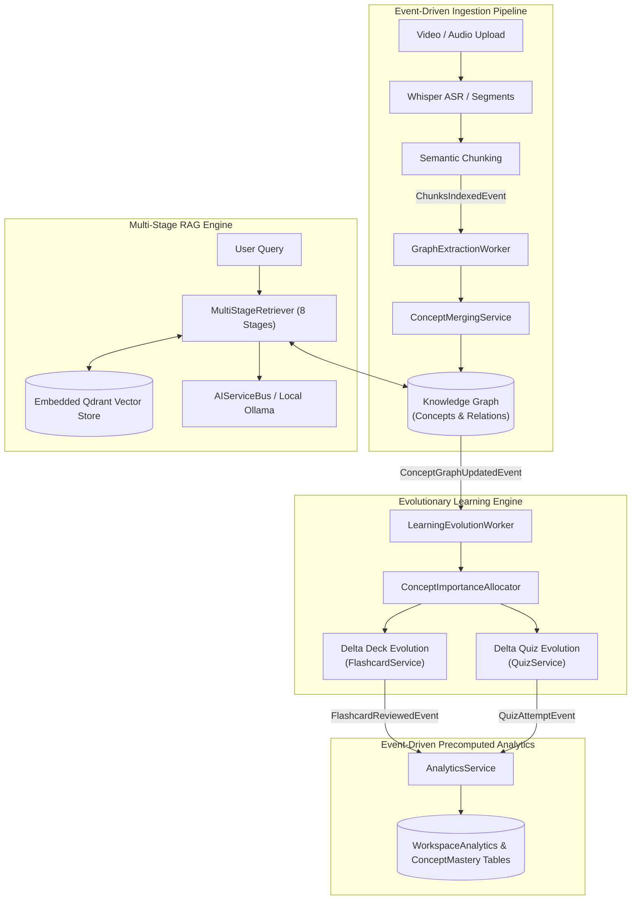

# ARCHITECTURE.md — Athenus Master Architecture Specification

This document serves as the canonical source of truth for the **Athenus** architecture, design decisions, data flows, and subsystem boundaries.

---

## 1. System Overview & Core Principles

Athenus is an **offline-capable, AI-native Learning Operating System** designed to transform unstructured video/audio lecture content into a unified, concept-centric knowledge network with active recall flashcards, adaptive diagnostic quizzes, and real-time retention analytics.

### 5 Core Design Principles
1. **Local-First & Offline-Capable**: Full functionality (SQLite metadata, embedded Qdrant vector search, Whisper ASR, local LLMs via Ollama) executes on the user's host without cloud dependencies.
2. **Concept-Centric Knowledge Foundation**: All downstream learning artifacts (flashcards, quizzes, study sessions) anchor directly to canonical concepts in the Knowledge Graph, never directly to raw transcript chunks.
3. **Evolutionary Workspace Knowledge**: Ingesting new materials automatically evolves workspace flashcard decks and quizzes (`vN+1`) while preserving 100% of existing SuperMemo-2 (SM-2) spaced-repetition schedules.
4. **Provider-Agnostic AI Bus**: Core domain services interface with LLM, Embedding, and Speech capabilities strictly via abstract capability interfaces (`AIServiceBus`).
5. **Strict Workspace Boundary Isolation**: All retrieval rankers, graph traversals, media streams, and factory resets operate within strict workspace boundaries to prevent cross-workspace data leakage.

---

## 2. High-Level Architecture & Event Pipeline

---

## 3. Component Ownership & Subsystem Boundaries

### 3.1 Presentation Layer (`frontend/` & `backend/app/presentation/api/v1/`)
- **Desktop Shell**: Tauri + Next.js 16 + Vanilla CSS + Zustand.
- **REST Endpoints**:
  - `media.py`: Asset upload, SSE stage progress streaming, file serving, processing history, and workspace-isolated asset queries (`GET /media/workspace/{id}`).
  - `chat.py`: RAG question-answering (`POST /chat/query`), conversation history restoration (`GET /chat/history`), and thread clearing (`DELETE /chat/history`).
  - `graph.py`: Concept search, shortest path traversal, neighbor expansion, and workspace graph export (`GET /graph/workspace/{id}`).
  - `learning.py`: Flashcard deck generation/evolution (`POST /learning/decks/generate`), review recording (`POST /learning/cards/{id}/review`), SM-2 due card surfacing, Anki `.apkg` export, quiz generation/evolution (`POST /learning/quizzes/generate`), attempt grading (`POST /learning/quizzes/{id}/attempt`), and workspace evolution settings (`GET/PATCH /learning/workspaces/{id}/settings`).
  - `analytics.py`: Real-time workspace analytics, concept mastery scores, activity feeds, and revision recommendations (`GET /analytics/workspace/{id}/summary`).
  - `system.py`: Global provider settings and 21-table factory reset (`POST /system/clear-data`).

### 3.2 Application Services & Event Bus (`backend/app/application/`)
- **`SystemResetService`**: Orchestrates 21-table transaction purges, vector collection resets, disk asset unlinking, and snapshot clearing.
- **`WorkspaceIntelligenceManager`**: Coordinates 8-stage retrieval execution and LLM response formatting.
- **`ProgressStore` & `media_event_handlers.py`**: Intercepts ingestion domain events and writes timestamped telemetry logs.

### 3.3 Domain Layer (`backend/app/domain/`)
- **`ConceptImportanceAllocator`**: Ranks concepts by graph degree, extraction weight, and low-mastery scores (<0.5) to allocate item budgets.
- **`FlashcardService` & `sm2.py`**: Implements SM-2 spaced repetition (Again/Hard/Good/Easy rating, floor 1.3 EF) and delta deck evolution (`evolve_workspace_deck`).
- **`QuizService`**: Manages concept-balanced quiz generation, grading, and delta quiz evolution (`evolve_workspace_quiz`).
- **`AnalyticsService`**: Listens to learning events (`QuizAttemptEvent`, `FlashcardReviewedEvent`, `ConceptGraphUpdatedEvent`) to maintain precomputed counters in SQLite.
- **`ConceptMergingService`**: Handles multi-strategy entity consolidation (exact match, alias mapping, 0.88 cosine similarity threshold).

### 3.4 Infrastructure Layer (`backend/app/infrastructure/`)
- **SQLite Database (`session.py` & `models.py`)**: Canonical store managing 21 SQLModel / SQLAlchemy ORM tables (`system_settings`, `workspaces`, `media_items`, `transcript_chunks`, `transcript_segments`, `chat_sessions`, `chat_messages`, `processing_logs`, `knowledge_concepts`, `knowledge_relations`, `concept_aliases`, `artifact_jobs`, `flashcard_decks`, `flashcards`, `flashcard_reviews`, `quizzes`, `quiz_questions`, `quiz_attempts`, `workspace_analytics`, `concept_mastery`, `study_sessions`).
- **`EmbeddedQdrantVectorStoreAdapter`**: 384-dimensional cosine vector index with `workspace_id` filtering.

---

## 4. Architectural Decision Records (ADRs) Summary

| ADR | Title | Key Decision |
|---|---|---|
| **[ADR 0001](file:///e:/repos/athenus/docs/adr/0001-sqlite-canonical-metadata-persistence.md)** | SQLite Canonical Metadata Persistence | Replaced volatile in-memory dictionary maps with SQLite (`./data/athenus.db`) for all metadata and conversation state. |
| **[ADR 0002](file:///e:/repos/athenus/docs/adr/0002-workspace-isolated-vector-retrieval.md)** | Workspace-Isolated Vector Retrieval | Implemented mandatory Qdrant payload filtering (`filter_workspace_id`) to prevent cross-workspace vector leakage. |
| **[ADR 0003](file:///e:/repos/athenus/docs/adr/0003-unified-ingestion-stage-audit-logging.md)** | Ingestion Audit Logging | Added `ProcessingLogTable` in SQLite to record timestamped ingestion telemetry accessible via `GET /media/{id}/history`. |
| **[ADR 0004](file:///e:/repos/athenus/docs/adr/0004-persistent-knowledge-graph-and-conversational-memory.md)** | Persistent Knowledge Graph & Memory | Stored concept nodes and relation triples in SQLite, expanded RAG prompts with Stage 4 graph triples, and added `DELETE /chat/history`. |
| **[ADR 0005](file:///e:/repos/athenus/docs/adr/0005-zero-dom-reparenting-video-player-and-per-message-citations.md)** | Zero DOM Re-parenting & Per-Message Citations | Implemented persistent CSS-hidden `VideoWorkspace` to prevent PiP video detachment, and stored citations per assistant response turn. |
| **[ADR 0006](file:///e:/repos/athenus/docs/adr/0006-multi-workspace-and-multi-session-architecture.md)** | Multi-Workspace & Multi-Session Architecture | Implemented a two-tier domain hierarchy (Workspace $\rightarrow$ Chat Sessions), single backend context source of truth, lazy session creation, and 9-step workspace switching lifecycle. |
| **[ADR 0007](file:///e:/repos/athenus/docs/adr/0007-sqlite-settings-persistence-and-local-ollama-scanner.md)** | SQLite Settings Persistence & Local Ollama Scanner | Stored all user system settings in SQLite `system_settings` table (`SettingsService`), rehydrated on startup, and implemented pure local filesystem scanner (`OllamaModelScanner`). |
| **[ADR 0008](file:///e:/repos/athenus/docs/adr/0008-dockerized-development-architecture.md)** | Dockerized Development Architecture | Containerized the web stack (`docker-compose.yml` + GPU overlay + prod), kept Tauri native, single `.env` for native/container runtimes, GPU-aware Whisper settings. |
| **[ADR 0009](file:///e:/repos/athenus/docs/adr/0009-concept-centric-knowledge-model-and-provenance.md)** | Concept-Centric Knowledge Model & Provenance | Anchored flashcards and quizzes directly to canonical knowledge concepts (`Flashcard -> Concept -> Transcript Chunk`) with 100% provenance citations. |
| **[ADR 0010](file:///e:/repos/athenus/docs/adr/0010-evolutionary-workspace-knowledge-delta-versioning.md)** | Evolutionary Workspace Knowledge Delta Versioning | Auto-evolved workspace decks and quizzes upon new video ingestion while preserving 100% of user SM-2 review progress. |
| **[ADR 0011](file:///e:/repos/athenus/docs/adr/0011-concept-importance-allocation-and-budget-constrained-ai.md)** | Concept Importance Allocation & Budget-Constrained AI | Weighted item generation by graph degree, extraction weight, and low-mastery scores under user-configurable Target Budgets (10-50). |
| **[ADR 0012](file:///e:/repos/athenus/docs/adr/0012-event-driven-precomputed-learning-analytics.md)** | Event-Driven Precomputed Learning Analytics | Subscribed to learning events to maintain denormalized counters in SQLite for real-time mastery and streak metrics. |
| **[ADR 0013](file:///e:/repos/athenus/docs/adr/0013-atomic-21-table-factory-reset-engine.md)** | Atomic 21-Table Factory Reset Engine | Implemented a complete 21-table child-to-parent deletion transaction, Qdrant collection reset, and disk file purge. |
| **[ADR 0014](file:///e:/repos/athenus/docs/adr/0014-strict-workspace-media-and-artifact-boundary-isolation.md)** | Strict Workspace Media & Artifact Boundary Isolation | Enforced workspace validation across store, hooks, and API endpoints to prevent cross-workspace media rendering. |
| **[ADR 0015](file:///e:/repos/athenus/docs/adr/0015-generic-background-task-runtime-and-multi-job-pipeline-engine.md)** | Generic BackgroundTaskRuntime Engine | Decoupled SSE lifecycles from Zustand, modeled multi-job registry (`jobs`), and implemented exponential backoff reconnects and polling fallbacks. |
| **[ADR 0016](file:///e:/repos/athenus/docs/adr/0016-centralized-telemetry-service-and-ingestion-stages-registry.md)** | Centralized Telemetry Service & Ingestion Stages Registry | Created `TelemetryService` and `INGESTION_STAGES` metadata registry writing directly to SQLite `ArtifactJobTable` as single system of record. |
| **[ADR 0017](file:///e:/repos/athenus/docs/adr/0017-state-driven-frontend-job-lifecycle-and-rehydration-engine.md)** | State-Driven Frontend Job Lifecycle & Rehydration Engine | Added `'queued'` filter to active stream subscriptions and connected `useJob` state transitions to automatic transcript re-fetching. |
| **[ADR 0018](file:///e:/repos/athenus/docs/adr/0018-version-seeded-variation-engine-and-physical-card-ux.md)** | Version-Seeded Variation Engine & Physical Card Studio UX | Resolved version content duplication via version-seeded pseudo-random generation, auto-selection of generated versions, completion toasts, and physical card UX. |

---

## 5. Known Limitations & Technical Debt

1. **ASR Execution Speed**: Faster-Whisper CPU execution for 2+ hour lecture videos can take several minutes on lower-spec hardware; CUDA acceleration is recommended.
2. **Single-User Desktop Concurrency**: SQLite single-writer locking limits write concurrency to a single desktop user (intentional for offline Knowledge OS simplicity).
3. **Anki Cloze Formatting**: `.apkg` export formats cloze cards into standardized HTML fields; native Anki cloze syntax parsing is scheduled for future updates.
