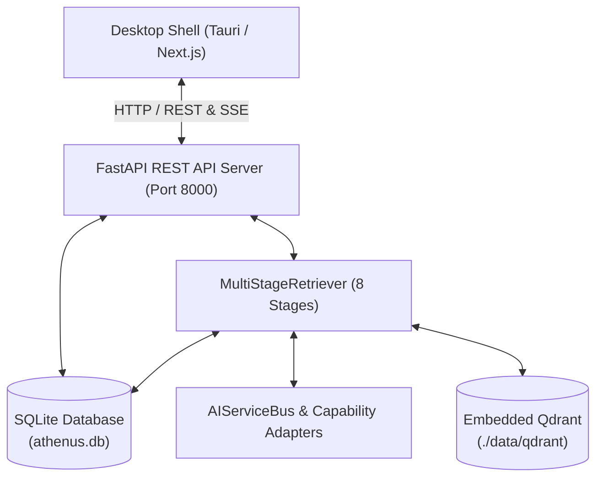
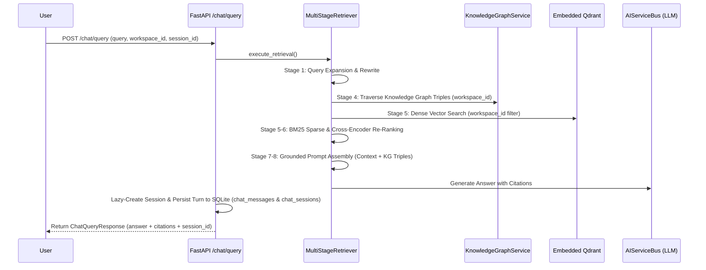

# ARCHITECTURE.md — Athenus Master Architecture Specification

This document serves as the canonical source of truth for the **Athenus** architecture, design decisions, data flows, and subsystem boundaries.

---

## 1. System Overview & Core Principles

Athenus is a **local-first, offline-capable learning operating system** designed to transform video/audio lecture content into an interactive, grounded AI learning assistant.

### 5 Core Design Principles
1. **Local-First & Offline-Capable**: Full functionality (database, vector search, ASR, RAG retrieval) runs on the user's desktop without requiring internet access.
2. **Provider-Agnostic AI Bus**: Core business logic interacts with LLM, Embedding, and ASR capabilities via abstract capability interfaces (`AIServiceBus`).
3. **Canonical Relational Metadata Store**: All system state (workspaces, media items, transcripts, chat history, ingestion audit logs, concept graphs) is stored canonically in **SQLite** (`./data/athenus.db`).
4. **Strict Workspace Isolation**: Retrieval operations scope vector searches, BM25 rankers, and knowledge graph traversals strictly to the active workspace.
5. **Observed & Observable AI Systems**: Every ingestion step and RAG retrieval turn is observable via persistent audit logs and clickable timestamp citations.

---

## 2. High-Level Architecture Topology



---

## 3. Component Ownership & Subsystem Boundaries

### 3.1 Presentation Layer (`frontend/` & `backend/app/presentation/api/v1/`)
- **Desktop Shell**: Tauri + Next.js 16 + Vanilla CSS + Zustand.
- **REST Endpoints**:
  - `media.py`: Asset upload, SSE stage progress streaming, file serving, history telemetry audit log.
  - `chat.py`: RAG question-answering (`POST /chat/query`), conversation history restoration (`GET /chat/history`), and chat clearing (`DELETE /chat/history`).
  - `workspaces.py`: Workspace lifecycle management.
  - `settings.py`: Provider settings (`GET/PUT /settings/providers`) and local Ollama model sources (`GET/PUT /settings/ollama`, `POST /settings/ollama/scan`).

### 3.2 Application Services & Event Bus (`backend/app/application/`)
- **`WorkspaceIntelligenceManager`**: Coordinates retrieval and text generation via `AIServiceBus`.
- **`ProgressStore` & `media_event_handlers.py`**: Intercepts domain events (`ProcessingStartedEvent`, `StageProgressEvent`, `TranscriptCompletedEvent`, `ChunksIndexedEvent`) and writes immutable telemetry rows to SQLite `processing_logs` table.

### 3.3 Domain Layer (`backend/app/domain/`)
- **`AIServiceBus`**: Abstract routing layer decoupling LLMs (`OllamaTextGenAdapter`, `CloudTextGenAdapter`), Embedding Models (`SentenceTransformersEmbeddingAdapter`), and Whisper ASR.
- **`SettingsService`**: Persistent global application settings domain service backed by SQLite (`SystemSettings` model).
- **`WorkspaceService`**: Workspace domain model backed by SQLite persistence with active workspace context tracking.
- **`SessionService`**: Multi-session domain service managing chat thread lifecycles, lazy session creation, and session preview metadata.
- **`KnowledgeGraphService`**: Concept node and edge graph traversal backed by SQLite (`knowledge_concepts`, `knowledge_relations`).

### 3.4 Infrastructure Layer (`backend/app/infrastructure/`)
- **SQLite Database (`session.py` & `models.py`)**: Canonical relational store managing 10 SQLModel / SQLAlchemy ORM tables (`system_settings`, `workspaces`, `media_items`, `transcript_chunks`, `transcript_segments`, `chat_sessions`, `chat_messages`, `processing_logs`, `knowledge_concepts`, `knowledge_relations`) with automatic column migrations on startup.
- **`SqliteMediaRepository`**: Persistent implementation of `MediaRepository` contract.
- **`EmbeddedQdrantVectorStoreAdapter`**: Local vector store using 384-dimensional cosine embeddings with payload `workspace_id` filtering.

---

## 4. Multi-Stage RAG Retrieval Pipeline (8 Stages)



---

## 5. Architectural Decision Records (ADRs) Summary

| ADR | Title | Key Decision |
|---|---|---|
| **[ADR 0001](file:///e:/repos/athenus/docs/adr/0001-sqlite-canonical-metadata-persistence.md)** | SQLite Canonical Metadata Persistence | Replaced volatile in-memory dictionary maps with SQLite (`./data/athenus.db`) for all metadata and conversation state. |
| **[ADR 0002](file:///e:/repos/athenus/docs/adr/0002-workspace-isolated-vector-retrieval.md)** | Workspace-Isolated Vector Retrieval | Implemented mandatory Qdrant payload filtering (`filter_workspace_id`) to prevent cross-workspace vector leakage. |
| **[ADR 0003](file:///e:/repos/athenus/docs/adr/0003-unified-ingestion-stage-audit-logging.md)** | Ingestion Audit Logging | Added `ProcessingLogTable` in SQLite to record timestamped ingestion telemetry accessible via `GET /media/{id}/history`. |
| **[ADR 0004](file:///e:/repos/athenus/docs/adr/0004-persistent-knowledge-graph-and-conversational-memory.md)** | Persistent Knowledge Graph & Memory | Stored concept nodes and relation triples in SQLite, expanded RAG prompts with Stage 4 graph triples, and added `DELETE /chat/history`. |
| **[ADR 0005](file:///e:/repos/athenus/docs/adr/0005-zero-dom-reparenting-video-player-and-per-message-citations.md)** | Zero DOM Re-parenting & Per-Message Citations | Implemented persistent CSS-hidden `VideoWorkspace` to prevent PiP video detachment, and stored citations per assistant response turn. |
| **[ADR 0006](file:///e:/repos/athenus/docs/adr/0006-multi-workspace-and-multi-session-architecture.md)** | Multi-Workspace & Multi-Session Architecture | Implemented a two-tier domain hierarchy (Workspace $\rightarrow$ Chat Sessions), single backend context source of truth, lazy session creation, and 9-step workspace switching lifecycle. |
| **[ADR 0007](file:///e:/repos/athenus/docs/adr/0007-sqlite-settings-persistence-and-local-ollama-scanner.md)** | SQLite Settings Persistence & Local Ollama Scanner | Stored all user system settings in SQLite `system_settings` table (`SettingsService`), rehydrated on startup, and implemented pure local filesystem scanner (`OllamaModelScanner`). |
| **[ADR 0008](file:///e:/repos/athenus/docs/adr/0008-dockerized-development-architecture.md)** | Dockerized Development Architecture | Containerized the web stack (`docker-compose.yml` + GPU overlay + prod), kept Tauri native, single `.env` for native/container runtimes, GPU-aware Whisper settings. |


---

## 6. Dockerized Development Architecture (ADR 0008)

Containerized **web development** and containerized **backend for desktop development**; the **Tauri desktop shell stays native** on the host (native OS webviews + Rust compilation).

```mermaid
graph TD
    subgraph DOCKER["Docker (athenus-net bridge network)"]
        FE["frontend<br/>Next.js dev :3000<br/>(docker/frontend/Dockerfile.dev)"]
        BE["backend<br/>FastAPI :8000<br/>(docker/backend/Dockerfile.dev / .gpu)"]
        OL["ollama<br/>:11434"]
        BE -->|HTTP http://ollama:11434| OL
        FE -->|HTTP http://backend:8000| BE
    end

    HOST_TAURI["Tauri Desktop Shell (native)"]
    BROWSER["Browser (Web Mode)"]

    BROWSER -->|http://localhost:3000| FE
    BROWSER ---|http://localhost:8000/api/v1| BE
    HOST_TAURI ---|http://localhost:8000/api/v1| BE
    HOST_TAURI -. fallback .->|host.docker.internal:11434| HOST_OLLAMA["Host Ollama (optional)"]
    BE -. fallback .-> HOST_OLLAMA

    DB[("SQLite ./data/athenus.db")]
    QD[("Embedded Qdrant ./data/qdrant")]
    HFC[("hf-cache volume")]
    OLDB[("ollama-data volume")]
    BE --- DB
    BE --- QD
    BE --- HFC
    OL --- OLDB
```

- **CPU default**: `docker compose up -d --build` → http://localhost:3000.
- **GPU (NVIDIA Container Toolkit)**: `docker compose -f docker-compose.yml -f docker-compose.gpu.yml up -d --build` — an overlay file that upgrades the existing `backend`/`ollama` services (CUDA image + `device_requests`) rather than duplicating them.
- **Desktop dev**: `docker compose up -d backend` then `cd frontend && npm run tauri dev`.
- **Production**: `docker compose -f docker-compose.prod.yml up -d --build` (multi-stage images, nginx static export on :80, non-root backend, `--workers 1`).

Key properties:
- Source bind mounts (`./backend`, `./frontend`) preserve Uvicorn `--reload` and Next.js HMR.
- `./data` is shared between web containers and the desktop shell (SQLite + Qdrant + uploads).
- `WHISPER_DEVICE` / `WHISPER_COMPUTE_TYPE` settings gate Faster-Whisper CPU vs CUDA (`float16`).
- Single `.env` serves both runtimes: native values in `.env.example`, container overrides in compose `environment:` blocks.

## 7. Known Limitations & Technical Debt

1. **ASR Execution Speed**: Faster-Whisper CPU execution for long 2-hour lecture videos can take several minutes.
2. **Single-User Desktop Model**: SQLite single-writer model limits concurrency to single desktop user (intentional design choice for offline Knowledge OS).
3. **Advanced Graph Entity Extraction**: Domain concept extraction currently relies on rule-based heuristics and chunk-level entity extraction workers; LLM-based entity-relation extraction is planned for Phase 5.
