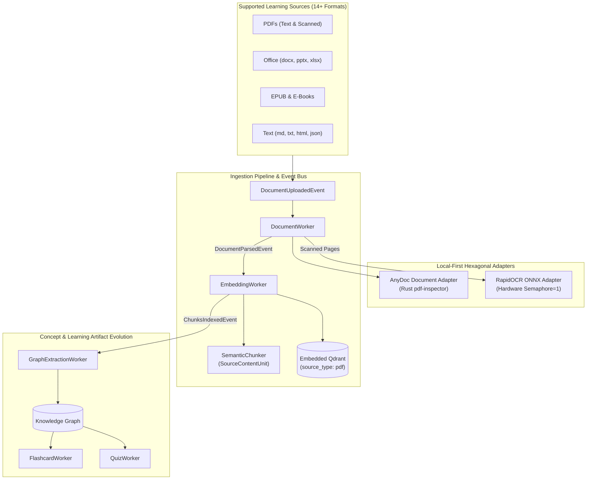
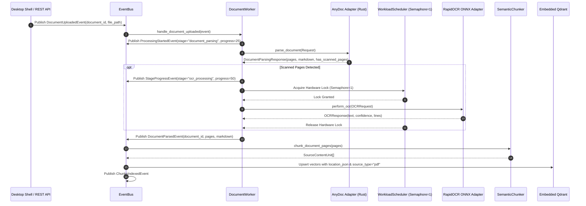

# DOCUMENT_INGESTION_ARCHITECTURE.md — Generalized Document & PDF Ingestion Architecture

This document serves as the canonical source of truth for the **Generalized Document and PDF Ingestion Architecture** in the **Athenus Knowledge OS**.

---

## 1. Executive Summary & Design Principles

Athenus generalizes beyond video/audio lecture ingestion to support first-class learning sources including PDFs (text-based, scanned, mixed), Microsoft Office documents (`.docx`, `.pptx`, `.xlsx`), OpenDocument files (`.odt`), EPUBs, HTML, Markdown, and plain text files.



### 5 Generalized Ingestion Principles
1. **Zero Impact on Video Speech Path**: Video/audio pipelines (`MediaUploadedEvent`, `TranscriptCompletedEvent`, Faster-Whisper ASR) remain 100% untouched. Document processing runs additively via `DocumentUploadedEvent` and `DocumentParsedEvent`.
2. **Unified Location Provenance (`location_json`)**: Avoids dual-branching across retrievers, models, and UI components by storing location metadata as a single discriminated field (`type: "video"`, `start_time`/`end_time` vs. `type: "document"`, `page`, `section`, `bbox`).
3. **Pure Local-First Hexagonal Ports**: Isolates AnyDoc document parsing (`IDocumentParsingCapability`) and RapidOCR text extraction (`IOCRCapability`) behind abstract ports without direct coupling to business logic or external cloud APIs.
4. **Strict Concurrency & Safety Guardrails**: Heavy ML passes (Faster-Whisper ASR and RapidOCR ONNX passes) share a global hardware semaphore default of `asyncio.Semaphore(1)` to prevent RAM/VRAM thrashing on desktop hardware. Fast text-based parsing bypasses the heavy lock.
5. **Downstream Artifact Equivalence**: Document text chunks, concepts, and relationships participate as first-class citizens in Knowledge Graph extraction, flashcards (Anki SM-2), quizzes, and RAG retrieval.

---

## 2. Ingestion Pipeline & Hardware Throttling Topology



---

## 3. Data Transfer Objects & Interface Protocols

### 3.1 Domain Capability Ports ([capabilities.py](file:///e:/repos/athenus/backend/app/domain/ai/capabilities.py#L54-L100))

#### `IDocumentParsingCapability`
```python
@dataclass
class DocumentPageDTO:
    page_number: int
    text: str
    page_type: str = "text"  # "text" | "scanned" | "mixed"
    section_title: Optional[str] = None
    metadata: Dict[str, Any] = field(default_factory=dict)

@dataclass
class DocumentParsingRequest:
    file_path: str
    file_format: Optional[str] = None
    max_pages: int = 200
    max_file_size_mb: float = 100.0

@dataclass
class DocumentParsingResponse:
    markdown: str
    pages: List[DocumentPageDTO]
    file_format: str
    total_pages: int
    has_scanned_pages: bool = False
    has_tables: bool = False
    language_detected: str = "en"

class IDocumentParsingCapability(Protocol):
    async def parse_document(self, request: DocumentParsingRequest) -> DocumentParsingResponse: ...
```

#### `IOCRCapability`
```python
@dataclass
class OCRLineDTO:
    text: str
    confidence: float = 1.0
    bbox: List[float] = field(default_factory=list)

@dataclass
class OCRRequest:
    image_path: str
    language: str = "en"
    page_number: int = 1

@dataclass
class OCRResponse:
    text: str
    confidence: float = 1.0
    lines: List[OCRLineDTO] = field(default_factory=list)

class IOCRCapability(Protocol):
    async def perform_ocr(self, request: OCRRequest) -> OCRResponse: ...
```

---

## 4. Multi-Stage RAG & Citation Formatting

### 4.1 Qdrant Vector Filtering & MultiStageRetriever ([multi_stage_retriever.py](file:///e:/repos/athenus/backend/app/infrastructure/retrieval/multi_stage_retriever.py))
`MultiStageRetriever` handles hybrid search across both video spoken content and document text:
- **Filter Parameters**: Supports `filter_source_type` (`"pdf"` / `"video"`) and `filter_document_id`.
- **Active Document Context**: When viewing a document on page $N$, extracts active page window context (`[Active Document Context]`).
- **Context Badges**: Formats compressed document badges `[Document Page X (Section Title)]` alongside video timestamp badges `[MM:SS - MM:SS]`.

### 4.2 Generalized Citation Parser ([citation_parser.py](file:///e:/repos/athenus/backend/app/domain/knowledge/citation_parser.py))
Parses both timestamp citations and document page citations:
```python
from app.domain.knowledge.citation_parser import parse_chat_citations

text = "Found in [01:30] and [Document Page 14 (Proof)]"
citations = parse_chat_citations(text)
# Output:
# [
#   {"source_type": "video", "start_time": 90.0, "end_time": 90.0},
#   {"source_type": "pdf", "page_number": 14, "section_title": "Proof"}
# ]
```

---

## 5. Security Guardrails & Over-Cap Policy

1. **File Size Limit Cap**: Hard-rejects files exceeding 100MB at validation (`status: "failed"`, `stage: "validation"`), returning an explicit error message prompting the user to split the file.
2. **Zip Decompression Bomb Protection**: Inspects zip container compression ratios (`.docx`, `.pptx`, `.xlsx`, `.epub`, `.odt`) and hard-rejects payloads with compression ratio > 100:1 and uncompressed size > 50MB.
3. **Page Count Cap**: Hard-rejects documents with total page count exceeding 200 pages.
4. **PyMuPDF Risk Elimination**: Eliminates PyMuPDF AGPL license risks by consuming `pdf-inspector`'s native Rust page classification (`TextBased`, `Scanned`, `ImageBased`, `Mixed`).

---

## 6. Architectural Decision Record (ADR) Index

- **[ADR 0021](file:///e:/repos/athenus/docs/adr/0021-generalized-document-pdf-ingestion-architecture.md)**: Generalized Document/PDF Ingestion Architecture (location_json, AnyDoc + RapidOCR, Semaphore=1 heavy path isolation, over-cap policy).

---

## 6.1 Frontend Consumption

The frontend integration of this backend capability is documented in
[FRONTEND_DOCUMENT_INGESTION_ARCHITECTURE.md](file:///e:/repos/athenus/docs/FRONTEND_DOCUMENT_INGESTION_ARCHITECTURE.md) —
covering the dual-modality workspace, page-aware chat query forwarding (`document_id` /
`source_type` / `current_page`), `📄 Page X` citation rendering, document ingestion stages, and the
active source context state model.

---

## 7. Technical Debt & Known Limitations

1. **OCR Multilingual Coverage**: RapidOCR default bundled models focus on English and standard Latin script (`en_PP-OCRv4`). Additional non-Latin script language packs are explicitly deferred.
2. **Bounding Box Canvas Rendering**: `bbox` coordinates are extracted and populated on `OCRLineDTO`, but UI canvas highlight rendering is explicitly deferred.
3. **Document Versioning**: Document re-uploading generates a new asset ID (`doc_xxx`). Re-uploading in-place with historical chunk version reconciliation is explicitly deferred.
