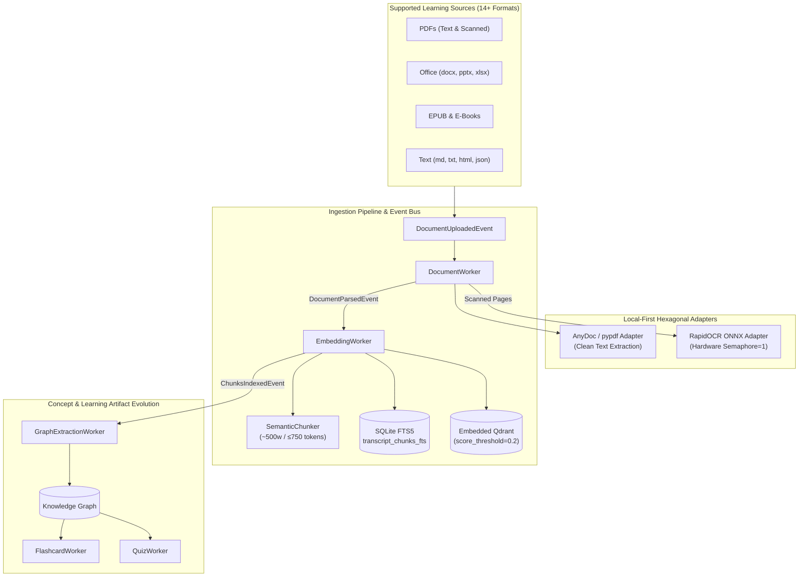

# DOCUMENT_INGESTION_ARCHITECTURE.md — Generalized Document & PDF Ingestion Architecture

This document serves as the canonical source of truth for the **Generalized Document and PDF Ingestion Architecture** in the **Athenus Knowledge OS**.

---

## 1. Executive Summary & Design Principles

Athenus generalizes beyond video/audio lecture ingestion to support first-class learning sources including PDFs (text-based, scanned, mixed), Microsoft Office documents (`.docx`, `.pptx`, `.xlsx`), OpenDocument files (`.odt`), EPUBs, HTML, Markdown, and plain text files.



### 5 Generalized Ingestion Principles
1. **Zero Impact on Video Speech Path**: Video/audio pipelines (`MediaUploadedEvent`, `TranscriptCompletedEvent`, Faster-Whisper ASR) remain 100% untouched. Document processing runs additively via `DocumentUploadedEvent` and `DocumentParsedEvent`.
2. **Sub-Chunking Integrity**: Document pages are divided into ~500-word sub-chunks with a strict hard ceiling of **$\le 750$ tokens** (`count_tokens()`) per chunk, preventing prompt overflow while preserving location provenance (`page`, `section`, `sub_chunk_index`, `total_sub_chunks`).
3. **Clean Text Extraction**: `AnyDocDocumentParsingAdapter._parse_with_fallback()` uses `pypdf.PdfReader` to extract clean page-by-page text while filtering out PDF binary stream objects (`endstream`, `endobj`) and embedded XMP metadata XML tags (`<x:xmpmeta>`).
4. **Unified Location Provenance (`location_json`)**: Stores location metadata as a single discriminated field (`type: "video"`, `start_time`/`end_time` vs. `type: "document"`, `page`, `section`, `sub_chunk_index`).
5. **Downstream Artifact Equivalence**: Sub-chunks, concepts, and relationships participate as first-class citizens in Knowledge Graph extraction, flashcards (Anki SM-2), quizzes, and multi-stage RAG retrieval.

---

## 2. Data Transfer Objects & Interface Protocols

### 2.1 Domain Capability Ports ([capabilities.py](file:///e:/repos/athenus/backend/app/domain/ai/capabilities.py#L54-L100))

#### `IDocumentParsingCapability`
```python
@dataclass
class DocumentPageDTO:
    page_number: int
    text: str
    page_type: str = "text"  # "text" | "scanned" | "mixed"
    section_title: Optional[str] = None
    metadata: Dict[str, Any] = field(default_factory=dict)

@dataclass
class DocumentParsingRequest:
    file_path: str
    file_format: Optional[str] = None
    max_pages: int = 2000
    max_file_size_mb: float = 100.0

@dataclass
class DocumentParsingResponse:
    markdown: str
    pages: List[DocumentPageDTO]
    file_format: str
    total_pages: int
    has_scanned_pages: bool = False
    has_tables: bool = False
    language_detected: str = "en"

class IDocumentParsingCapability(Protocol):
    async def parse_document(self, request: DocumentParsingRequest) -> DocumentParsingResponse: ...
```

---

## 3. Security Guardrails & Over-Cap Policy

1. **File Size Limit Cap**: Hard-rejects files exceeding 100MB at validation (`status: "failed"`, `stage: "validation"`), returning an explicit error message prompting the user to split the file.
2. **Zip Decompression Bomb Protection**: Inspects zip container compression ratios (`.docx`, `.pptx`, `.xlsx`, `.epub`, `.odt`) and hard-rejects payloads with compression ratio > 100:1 and uncompressed size > 50MB.
3. **Page Count Cap**: Supports large textbooks and reference manuals up to **2,000 pages** while maintaining the 100MB file size limit.
4. **Legacy Content Queue Migration**: Server startup `boot_recovery()` scans SQLite `transcript_chunks` for legacy whole-page documents (`media_type == 'document'`) and enqueues `rechunk_ingestion` jobs in `PersistentIngestionWorker` to migrate legacy pages to ~500-word sub-chunks idempotently.
