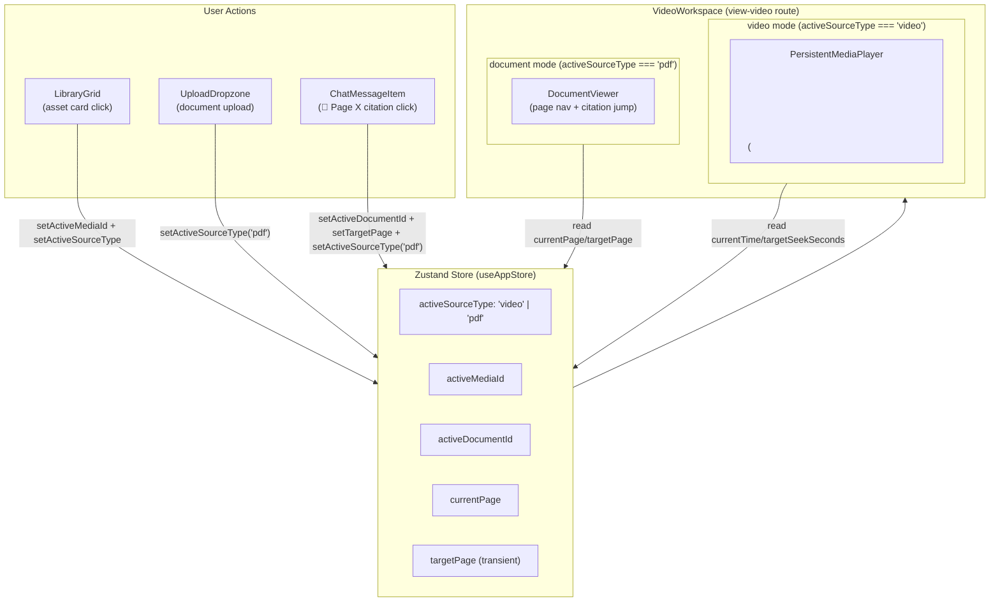
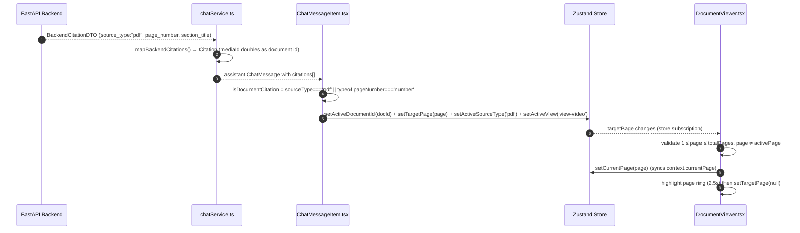

# FRONTEND_DOCUMENT_INGESTION_ARCHITECTURE.md — Frontend Generalized Document & PDF Ingestion

This document serves as the canonical source of truth for the **frontend** integration of the
Generalized Document and PDF Ingestion Architecture. The backend side is documented in
[DOCUMENT_INGESTION_ARCHITECTURE.md](file:///e:/repos/athenus/docs/DOCUMENT_INGESTION_ARCHITECTURE.md)
and [ADR 0021](file:///e:/repos/athenus/docs/adr/0021-generalized-document-pdf-ingestion-architecture.md).

It captures how the Next.js + Zustand frontend consumes the new backend capabilities: page-aware
chat queries, dual-modality workspaces (video player **or** document reader), generalized citation
rendering, document ingestion stage monitoring, and the active source context state model.

---

## 1. Executive Summary & Design Principles

Athenus's frontend was originally video-centric: the workspace rendered an HTML5 video player with a
synced transcript, chat queries were anchored to `media_id` + `current_timestamp`, and citations
were `⏱ MM:SS` seek badges. Phases 1–4 generalized this frontend so PDFs and office documents are
first-class citizens without regressing any video behavior.

### 4 Frontend Design Principles

1. **Zero Video Regression Guarantee**: Every legacy video path (upload flow, player seeking,
   `⏱ MM:SS` citation clicks, PiP detachment prevention, transcript syncing) is byte-for-byte
   preserved. New document behavior is *additive* — it activates only when the active source
   type is `'pdf'`.
2. **Modality Discriminator (`sourceType: 'video' | 'pdf'`)**: One typed field is threaded
   end-to-end — from `BackendCitationDTO` → frontend `Citation` → Zustand store → chat query
   payload → citation badge rendering → workspace layout. `typeof pageNumber === 'number'`
   serves as a secondary document signal for backward compatibility with backends that omit
   `source_type`.
3. **Backward-Compatible Optional Fields**: Every new document field (`source_type`,
   `page_number`, `section_title`, `location`, `document_id`, `current_page`) is optional in
   DTOs, types, and request payloads. When the workspace is in video mode, document params are
   transmitted as `undefined`, so the legacy API contract is unchanged.
4. **Transient Navigation Trigger (`targetPage`)**: Citation clicks set a one-shot `targetPage`
   store field. The `DocumentViewer` consumes it (navigates + highlights), then clears it. This
   prevents stale values from re-triggering navigation on re-mounts.

---

## 2. Dual-Modality Workspace Topology

The workspace component owns the modality branch. `VideoWorkspace.tsx` renders either the
`<video>` player (`PersistentMediaPlayer`) or `DocumentViewer` depending on `activeSourceType`.



> [!NOTE]
> The route id `'view-video'` is **reused** for both modalities — `VideoWorkspace.tsx` is the sole
> workspace component, and `activeSourceType` decides which component fills the primary area. This
> overloads the route name but preserves the single-workspace navigation model (ADR 0005).

---

## 3. State Model — Active Source Context

The `UISlice` in `frontend/src/store/useAppStore.ts` owns four new state variables alongside the
legacy media state:

| Store field | Type | Default | Purpose |
| :--- | :--- | :--- | :--- |
| `activeDocumentId` | `string \| null` | `null` | Currently open document asset id |
| `activeSourceType` | `'video' \| 'pdf'` | `'video'` | Modality discriminator for the workspace |
| `currentPage` | `number \| null` | `null` | Page being viewed (drives page-aware queries) |
| `targetPage` | `number \| null` | `null` | One-shot citation-jump trigger (transient) |

### Context Mirroring

The flat store fields are kept in sync with the persisted `WorkspaceContext` object
(`frontend/src/types/workspaceContext.ts`) by each setter:

| Action | Updates flat field | Syncs `context` |
| :--- | :--- | :--- |
| `setActiveDocumentId` | `activeDocumentId` | `context.documentId` |
| `setActiveSourceType` | `activeSourceType` | `context.sourceType` |
| `setCurrentPage` | `currentPage` | `context.currentPage` |
| `setTargetPage` | `targetPage` only | ❌ (transient nav trigger — never persisted) |

`BackgroundJob.stage` also accepts the two new document stages — `'document_parsing'` and
`'ocr_processing'` — so ingestion polling results type-check across the app.

---

## 4. Data Flow — Page-Aware Citation Jump

The end-to-end flow from a backend document citation to a page jump in the reader:



For **video citations**, the legacy flow is untouched: `handleVideoCitationClick` parses `MM:SS` →
`setTargetSeekSeconds(secs)` → `setActiveSourceType('video')` → player seeks.

---

## 5. Component Ownership Map

| File (relative to `frontend/src/`) | Responsibility | Phase |
| :--- | :--- | :--- |
| `services/chatService.ts` | Extends `BackendCitationDTO` with optional doc fields; `sendChatQuery` transmits `document_id` / `source_type` / `current_page`; `mapBackendCitations` projects page/section/location with NaN guard | 1 |
| `features/chat/types.ts` | `Citation` gains optional `sourceType`, `pageNumber`, `sectionTitle`, `location` | 1 |
| `types/workspaceContext.ts` | `WorkspaceContext` gains `documentId`, `sourceType`, `currentPage` | 1 |
| `store/useAppStore.ts` | `UISlice` active-source-context state + setters + `context` mirroring; `BackgroundJob.stage` union widened | 1 |
| `features/ingestion/UploadDropzone.tsx` | `accept` widened to documents; copy updated (video, audio, **or document**) | 2 |
| `features/ingestion/useIngestion.ts` | `DOCUMENT_STAGES` template (AnyDoc / RapidOCR labels); `isDocumentJob()` heuristic; `handleFileUpload` flips `activeSourceType` for document files | 2, 4 |
| `features/chat/ChatMessageItem.tsx` | Citation badge rendering branches on modality: `📄 Page X (Section)` (accent) vs `⏱ MM:SS` (secondary); dedicated click handlers per modality | 3 |
| `features/chat/useChat.ts` | `sendMessage` transmits document context **only** when `activeSourceType === 'pdf'`; video keeps legacy payload | 3 |
| `components/DocumentViewer.tsx` | **NEW** — page reader: Prev/Next, jump input, `targetPage` listener + highlight, `currentPage` write-back, bounds-safe | 4 |
| `features/video/VideoWorkspace.tsx` | Dual-modality branch: renders `DocumentViewer` vs `<video>`; document-mode empty state, control bar, hidden side panel/resize handle | 4 |
| `features/library/LibraryGrid.tsx` | Asset cards show `📄`/`🎬` modality icons via heuristic (see §8) | 4 |

---

## 6. API Contract Changes

### `BackendCitationDTO` (extended, all optional)

```ts
interface BackendCitationDTO {
  chunk_id?: string;
  start_time: number;
  end_time: number;
  text: string;
  source_type?: 'video' | 'pdf';
  page_number?: number | null;
  section_title?: string | null;
  location?: Record<string, any> | null;
}
```

### `sendChatQuery` payload

```jsonc
{
  "query": "...",
  "workspace_id": "default",
  "session_id": null,
  "media_id": "med_123",        // legacy video path (unchanged)
  "current_timestamp": 42.0,    // legacy video path (unchanged)
  "selected_text": null,
  "document_id": "doc_abc",     // PDF mode only — undefined for video
  "source_type": "pdf",         // PDF mode only — undefined for video
  "current_page": 12            // PDF mode only — undefined for video
}
```

For video queries, `document_id` / `source_type` / `current_page` are serialized as `undefined`
and **omitted** from the wire payload — the legacy `media_id` + `current_timestamp` contract is
preserved byte-for-byte (Zero Video Regression at the API layer).

### Citation mapping NaN guard

```ts
pageNumber: typeof c.page_number === 'number' ? c.page_number : undefined
```

A backend `null` / `undefined` page number maps to `undefined` (never `NaN`).

---

## 7. Ingestion UI — Document Stage Monitoring

`useIngestion.ts` renders one of two base stage templates based on the `isDocumentJob()` heuristic
(scans `job_type + stage + title` for `document|pdf|docx`, or a `document_parsing` / `ocr_processing`
stage). Backend stage ids map onto the document stepper:

| Backend `stage` | Document flow label | Stepper index |
| :--- | :--- | :--- |
| `queued` / `document_parsing` | *Receiving Document Upload* → *Parsing Document Structure (AnyDoc)* | 0 |
| `ocr_processing` | *Extracting Text from Scanned Pages (RapidOCR)* | 1 |
| `chunking` / `vector_indexing` | *Indexing Vector Embeddings* | 2 |
| `graph_extraction` / `ready` | *Finalizing* | 3 |

The legacy `INITIAL_STAGES` (Hermes / Apollo / Athenus / Owl) is preserved for video/audio flows.
`handleFileUpload` detects document modality by extension regex and flips `setActiveSourceType('pdf')`
before hitting the backend, so the workspace is already in document mode when ingestion completes.

---

## 8. Known Limitations & Technical Debt

1. **`LibraryGrid` modality heuristic is a stopgap**: The backend library DTO does not yet expose a
   per-asset `source_type` field, so document detection relies on `duration === '00:00'` / id
   contains `doc`/`pdf` / thumbnail emoji. **Worse**, `handleSelectAsset` always forces
   `setActiveSourceType('video')` — selecting a document asset from the grid never routes into
   `DocumentViewer`. Fix: add `source_type` to the backend asset DTO and branch on it in
   `LibraryGrid.tsx` (and the `MediaAsset` mapping in `useLibrary.ts`).
2. **`view-video` route is overloaded** for both modalities. `activeSourceType` disambiguates, but
   route-aware tooling (analytics, deep links) cannot distinguish them. A dedicated `view-document`
   route is a candidate future refactor.
3. **`DocumentViewer` is presentational only**: it renders `pageSections` when supplied and a
   graceful placeholder otherwise, but does not itself fetch document content from the backend.
   Page content loading (a `GET /documents/{id}/pages` contract) is pending.
4. **`activeDocumentId` is not persisted** to `localStorage`, unlike `activeMediaId`. On app restart
   the document context resets to `null`; a persisted variant would restore the last open document.
5. **`EmbeddedChatWidget` (video side panel) is intentionally video-only**: its citations always
   render as `⏱` badges because the panel only mounts when `activeSourceType !== 'pdf'`. Its chat
   history is shared with the full chat workspace via `useChat`.
6. **Backend contract alignment**: page-aware query parameters (`document_id`, `source_type`,
   `current_page`) are transmitted by the frontend but must be consumed by the backend
   `POST /api/v1/chat/query` handler and `MultiStageRetriever` to be effective (per ADR 0021 §4).

---

## 9. Verification & Build Integrity

- `npx tsc --noEmit` — clean (0 errors) across all four phases.
- `npm run build` (`next build`, Next.js 16.2.12 / Turbopack) — passes with prerendered static routes.
- Legacy video regression rows (upload, seek, citation click, PiP) verified manually; see
  [walkthrough.md](file:///e:/repos/athenus/walkthrough.md) for the full step-by-step and QA matrix.

---

## 10. Architectural Decision Record (ADR) Index

| ADR | Title | Relevance to frontend |
| :--- | :--- | :--- |
| **[ADR 0022](file:///e:/repos/athenus/docs/adr/0022-frontend-document-pdf-ingestion-integration.md)** | Frontend Document & PDF Ingestion Integration | Canonical ADR for this implementation (phases 1–4): dual-modality workspace, `activeSourceType` discriminator, page-aware queries, citation badges, transient `targetPage` |
| **[ADR 0021](file:///e:/repos/athenus/docs/adr/0021-generalized-document-pdf-ingestion-architecture.md)** | Generalized Document & PDF Ingestion | Backend capability this frontend consumes (location_json, page citations, over-cap policy) |
| **[ADR 0005](file:///e:/repos/athenus/docs/adr/0005-zero-dom-reparenting-video-player-and-per-message-citations.md)** | Zero DOM Re-parenting & Per-Message Citations | Single persistent workspace component; document reader inherits this model |
| **[ADR 0006](file:///e:/repos/athenus/docs/adr/0006-multi-workspace-and-multi-session-architecture.md)** | Multi-Workspace & Multi-Session | Chat session/context model that page-aware queries extend |
