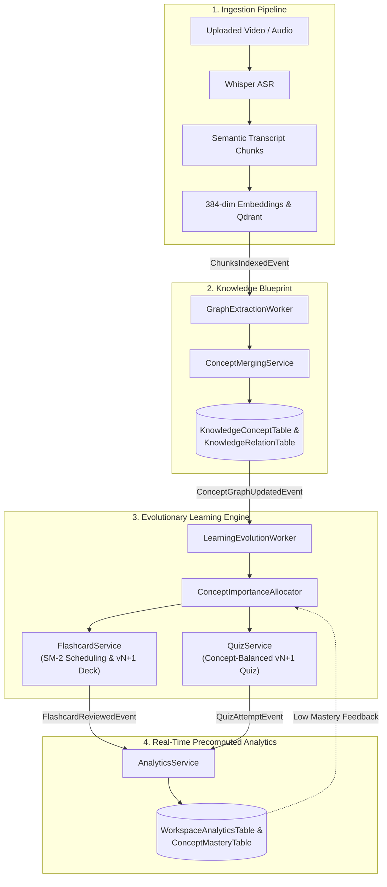
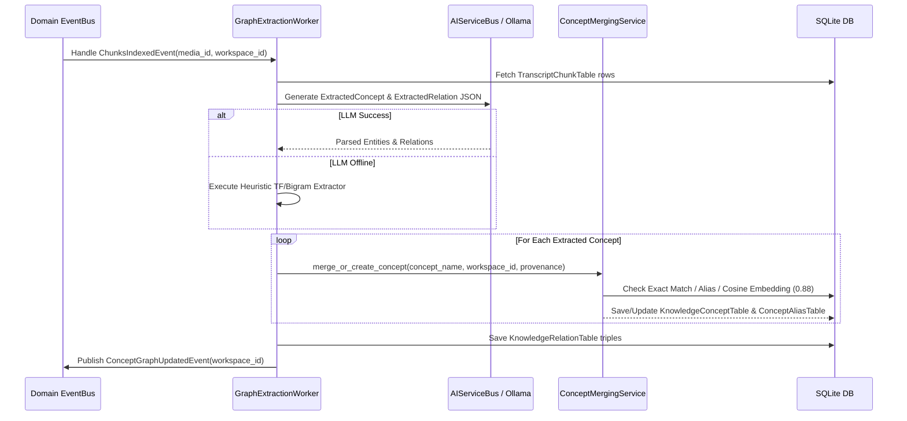
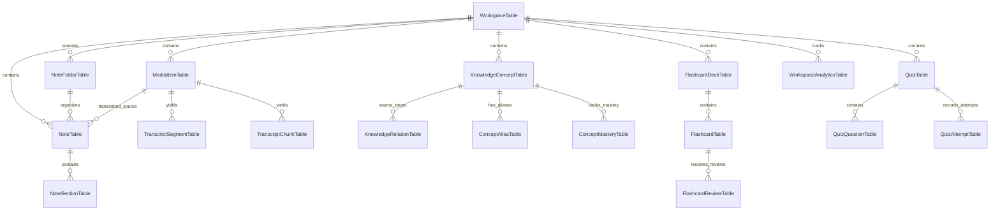
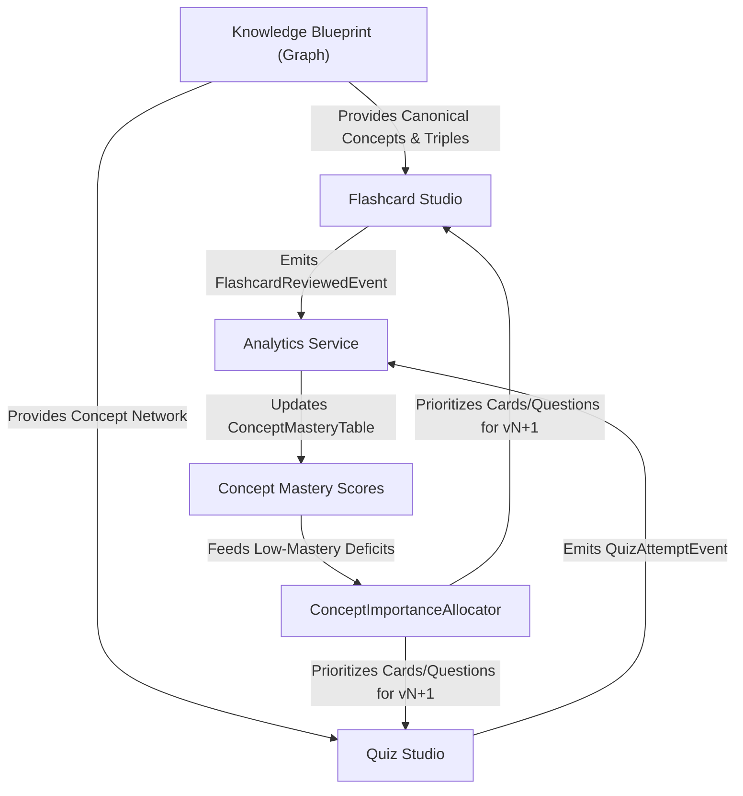

# LEARNING_PIPELINE_ARCHITECTURE.md — End-to-End Learning Subsystems Architecture

This document provides a comprehensive architectural specification of the four core AI learning subsystems in **Athenus**: **Blueprints (Knowledge Graph)**, **Active Recall Flashcards**, **Adaptive Diagnostic Quizzes**, and **Precomputed Learning Analytics**.

---

## 1. High-Level Architectural Flywheel

Athenus operates as an **Event-Driven Learning Flywheel**. Every lecture video uploaded into a workspace flows through a multi-stage ingestion pipeline, populates a concept-centric Knowledge Graph, generates versioned active recall artifacts under dynamic budget allocation, and feeds all review/quiz interactions into precomputed real-time retention analytics.



---

## 2. Generation Pipelines

### 2.1 Subsystem 1: Blueprints (Knowledge Graph)
- **Trigger**: `ChunksIndexedEvent` published on the `EventBus` by `EmbeddingWorker` upon completion of transcript chunk indexing.
- **Components**: `GraphExtractionWorker` (`services/workers/graph_extraction_worker.py`), `ConceptMergingService` (`domain/knowledge/concept_merging.py`), and `KnowledgeGraphService`.
- **Transformation Pipeline**:
  1. `GraphExtractionWorker` reads canonical `TranscriptChunkTable` rows for the processed `media_id`.
  2. Invokes LLM capability (`ai_service_bus.get_text_capability().generate()`) with a structured extraction prompt requesting domain concepts, descriptions, relationship triples (`source`, `target`, `relation_type`), and exact chunk indices.
  3. *Offline Fallback*: If LLM generation fails or is offline, a rule-based TF/bigram heuristic extractor parses key phrase candidates.
  4. Extracted entities pass into `ConceptMergingService` for 3-tier deduplication:
     - **Tier 1 (Exact)**: Normalized name match against existing `KnowledgeConceptTable` rows.
     - **Tier 2 (Alias)**: Alias lookup in `ConceptAliasTable`.
     - **Tier 3 (Semantic)**: Cosine similarity check between candidate embedding and existing concept embeddings ($\text{threshold} \ge 0.88$).
  5. If merged, provenance (`media_id`, `source_chunk_ids`, `start_time`, `end_time`) is aggregated onto the canonical node.
- **Persistence**: Writes `KnowledgeConceptTable`, `KnowledgeRelationTable`, `ConceptAliasTable`, and sets `ArtifactJobTable` status to `ready`.
- **Event Emitted**: Publishes `ConceptGraphUpdatedEvent`.



---

### 2.2 Subsystem 2: Active Recall Flashcards
- **Trigger**: Direct on-demand request (`POST /api/v1/learning/decks/{ws}?force_new_version=true`) from the Flashcard Studio tab.
- **Components**: `FlashcardService`, `ConceptImportanceAllocator`, `flashcard_generation.py`, and `sm2.py`.
- **Transformation Pipeline**:
  1. `ConceptImportanceAllocator` ranks workspace concepts by graph degree, extraction weight, and low-mastery scores (<0.5) from `ConceptMasteryTable`.
  2. Allocates a target budget density across foundational concepts (`Compact`, `Standard`, `Deep`).
  3. `FlashcardService` executes deck generation via `AIServiceBus` (injected via process-wide `set_ai_service_bus()`):
     - **Local-First Timeout Policy**: Text generation POST requests to Ollama operate with infinite read timeouts (`httpx.Timeout(timeout=None, connect=10.0)`), allowing local inference to run to completion without artificial wall-clock cancellation.
     - **Error Integrity**: Provider failures raise explicit `RuntimeError` exceptions. Intentional heuristic fallbacks execute only if LLM generation raises an explicit exception.
     - **Initial Deck (`v1`)**: Generates card questions (`basic`, `cloze`, `definition`, `true_false`) via LLM prompt, setting initial SM-2 state (`ease_factor=2.5`, `interval_days=0`, `repetitions=0`).
     - **Regeneration & Evolution (`vN+1`)**: Generates a new immutable version record (`deck_{ws}_vN+1`) with an independent database identity, invoking genuine LLM generation to produce distinct card content.
  4. **Physical Card UX**: Flashcard Studio presents a physical card layout (Front = Question, Back = Answer ONLY), eliminating SM-2 metric clutter from the primary browsing grid.
- **Persistence**: Writes `FlashcardDeckTable` (`version=N+1`) and `FlashcardTable` rows.

---

### 2.3 Subsystem 3: Adaptive Diagnostic Quizzes
- **Trigger**: Direct on-demand request (`POST /api/v1/learning/quizzes/{ws}/generate?force_new_version=true`) from the Quiz Studio tab.
- **Components**: `QuizService` (`domain/learning/quiz_service.py`), `ConceptImportanceAllocator`, and `quiz_generation.py`.
- **Transformation Pipeline**:
  1. `ConceptImportanceAllocator` samples concepts according to workspace importance weight and user mastery deficits.
  2. Invokes `QuizService.generate_quiz()`:
     - Prompts LLM capability via `AIServiceBus` to produce concept-balanced multiple-choice questions (4 options, correct answer index, explanation, and provenance links).
     - **Local-First Read Timeout & Error Integrity**: LLM generation read requests run without artificial timeouts, and provider errors raise explicit exceptions rather than returning fake fallback text. Heuristic fallbacks execute only upon explicit exceptions.
     - **Regeneration (`vN+1`)**: Generates a new immutable version record (`quiz_{ws}_vN+1`) with independent database identity and newly generated question content.
  3. `QuizService.grade_attempt()` evaluates user submissions, calculates score percentage, and persists an immutable `QuizAttemptTable` row.
- **Persistence**: Writes `QuizTable`, `QuizQuestionTable`, and `QuizAttemptTable`.
- **Event Emitted**: Publishes `QuizAttemptEvent`.

---

### 2.4 Subsystem 4: Persistent Notes Workspace
- **Trigger**: Manual note/folder actions, recording completion, or **Generate Notes** in the Notes workspace.
- **Components**: `NoteService` (`domain/learning/note_service.py`), Faster-Whisper media ingestion, `note_generation.py`, and the Notes frontend feature.
- **Transformation Pipeline**:
  1. Users create notes inside the active folder or **Unorganized Notes**, then edit the title and Markdown content with debounced persistence.
  2. Stopping a recording uploads it through the media pipeline and stores the resulting `media_id` on the active note. The UI polls the canonical transcript endpoint while Faster-Whisper finishes.
  3. **Generate Notes** reads the linked transcript chunks and canonical concepts, invokes the configured text capability, and falls back to deterministic heuristic synthesis when the LLM is unavailable.
  4. Executive summary, action items, and ordered grounded sections are written back to the same note without replacing its manual Markdown or folder placement.
- **Persistence**: Writes `NoteFolderTable`, `NoteTable`, and `NoteSectionTable`. Deleting a folder transactionally deletes its notes and their generated sections.

---

### 2.5 Subsystem 5: Precomputed Learning Analytics
- **Trigger**: Asynchronous event handlers subscribed to `QuizAttemptEvent`, `FlashcardReviewedEvent`, and `ConceptGraphUpdatedEvent`.
- **Components**: `AnalyticsService` (`domain/analytics/analytics_service.py`).
- **Transformation Pipeline**:
  1. On `FlashcardReviewedEvent` (rating 1-4: Again, Hard, Good, Easy):
     - Updates `WorkspaceAnalyticsTable` counter `total_reviews`.
     - Recalculates `ConceptMasteryTable.mastery_level` for the card's concept:
       $$\text{Mastery} = 0.6 \times \text{QuizAccuracy} + 0.4 \times \text{ReviewCoverage} + \text{StreakBonus}$$
     - Updates daily review streak in `WorkspaceAnalyticsTable` (same-day $\rightarrow$ maintain, $+1$ day $\rightarrow$ increment, $>1$ day gap $\rightarrow$ reset to 1).
  2. On `QuizAttemptEvent`:
     - Increments `total_quiz_attempts`, updates `avg_quiz_score`, and updates `ConceptMasteryTable` accuracy stats for each tested question.
- **Persistence**: Writes `WorkspaceAnalyticsTable`, `ConceptMasteryTable`, and `StudySessionTable`.

---

## 3. Data Flow Architecture

The following diagram details the flow of data from raw video upload to database persistence and frontend presentation:

```
[Uploaded Video MP4]
       │
       ▼ (Multipart HTTP Upload)
[Host Disk: ./data/uploads/med_xxx.mp4] ──► [MediaItemTable]
       │
       ▼ (Faster-Whisper ASR)
[TranscriptSegmentTable (raw text + start_time/end_time)]
       │
       ▼ (Semantic Chunker & SentenceTransformers)
[TranscriptChunkTable] ──► [Embedded Qdrant Vector Collection (384-dim)]
       │
       ▼ (ChunksIndexedEvent -> GraphExtractionWorker)
[KnowledgeConceptTable] ──► [KnowledgeRelationTable] & [ConceptAliasTable]
       │
       ▼ (ConceptGraphUpdatedEvent -> LearningEvolutionWorker)
[ConceptImportanceAllocator] (Reads Concept Masteries & Graph Degrees)
       │
       ├─────────────────────────────────┐
       ▼                                 ▼
[FlashcardDeckTable (vN+1)]     [QuizTable (vN+1)]
[FlashcardTable]                [QuizQuestionTable]
       │                                 │
       ▼ (User Reviews Card)             ▼ (User Submits Quiz)
[FlashcardReviewTable]          [QuizAttemptTable]
       │                                 │
       └────────────────┬────────────────┘
                        ▼ (EventBus: FlashcardReviewedEvent / QuizAttemptEvent)
          [AnalyticsService Precomputation]
                        │
                        ▼
          [WorkspaceAnalyticsTable & ConceptMasteryTable]
                        │
                        ▼ (REST API GET /analytics/workspace/{id}/summary)
          [Frontend Analytics Dashboard & Studio UIs]
```

---

## 4. Database Architecture (24 Tables & Provenance Contract)

### 4.1 Entity Relationship Diagram



### 4.2 Provenance Grounding Contract
Every learning artifact (concept, flashcard, quiz question) contains four strict provenance columns:
- `media_id`: Originating lecture video ID.
- `source_chunk_ids`: JSON array of semantic transcript chunk IDs.
- `start_time`: Float timestamp (in seconds) marking start of explanation.
- `end_time`: Float timestamp (in seconds) marking end of explanation.

### 4.3 Immutable Versioning Model
- **Decks & Quizzes**: Decks and quizzes are immutable versioned snapshots (`version=1`, `version=2`).
- **Review & Attempt History**: Review entries (`FlashcardReviewTable`) and quiz attempts (`QuizAttemptTable`) point to specific card and version IDs. Evolving a workspace deck creates `vN+1` while preserving 100% of prior review logs and SM-2 interval progress.

---

## 5. Retrieval & Usage Architecture

### 5.1 Backend REST Endpoints

| View / Studio | Endpoint | Method | Responsibilities |
|---|---|---|---|
| **Blueprint** (`view-graph`) | `/api/v1/graph/workspace/{id}` | GET | Returns interactive graph network (`nodes`, `edges`, `provenance`). |
| | `/api/v1/graph/concepts/shortest-path` | GET | Computes shortest prerequisite path between two concepts. |
| **Flashcards** (`view-flashcards`) | `/api/v1/learning/decks/generate` | POST | On-demand deck generation/evolution with Target Budget. |
| | `/api/v1/learning/decks/{id}/due` | GET | Surfaces SM-2 due cards for active recall study. |
| | `/api/v1/learning/cards/{id}/review` | POST | Records SM-2 rating (1-4) and publishes `FlashcardReviewedEvent`. |
| | `/api/v1/learning/decks/{id}/export` | GET | Exports deck as CSV or Anki `.apkg` file. |
| **Quiz Studio** (`view-quiz`) | `/api/v1/learning/quizzes/generate` | POST | On-demand quiz generation/evolution with Target Budget. |
| | `/api/v1/learning/quizzes/{id}/attempt` | POST | Grades user attempt, saves score, and publishes `QuizAttemptEvent`. |
| **Notes** (`view-notes`) | `/api/v1/learning/folders/{workspace_id}` | GET/POST | Lists or creates workspace note folders. |
| | `/api/v1/learning/folders/{folder_id}` | PATCH/DELETE | Renames a folder or cascade-deletes its notes and sections. |
| | `/api/v1/learning/notes/{workspace_id}/item` | POST | Creates an editable note in the selected folder or Unorganized Notes. |
| | `/api/v1/learning/notes/item/{note_id}` | GET/PATCH/DELETE | Retrieves, autosaves, reassigns, or deletes one note. |
| | `/api/v1/learning/notes/item/{note_id}/attach-audio` | POST | Persists a transcribed media link on the note. |
| | `/api/v1/learning/notes/item/{note_id}/generate` | POST | Persists grounded AI summary, actions, and sections on the active note. |
| **Analytics** (`view-analytics`) | `/api/v1/analytics/workspace/{id}/summary` | GET | Returns precomputed analytics, concept masteries, and revision plan. |

---

## 6. AI Architecture & Hallucination Prevention

### 6.1 Grounded Generation Strategy
To prevent AI hallucinations, flashcards and quiz questions are **never generated from ungrounded general knowledge**. Generation follows a strict 3-level constraint:
1. **Context Window Constraint**: The LLM prompt is injected only with extracted concept definitions, exact transcript chunk text, and provenances.
2. **JSON Schema Parsing**: Responses are enforced via Pydantic schema parsers (`FlashcardGenerationResponse`, `QuizGenerationResponse`).
3. **Fallback Determinism**: If the LLM produces invalid JSON or is offline, deterministic heuristic generators produce cloze/definition cards and distractor-sampled questions from indexed concepts.

---

## 7. Subsystem Interdependencies

The four subsystems form a tightly integrated dependency matrix:



1. **Graph $\rightarrow$ Flashcards/Quizzes**: Flashcards and quizzes consume canonical concept nodes from `KnowledgeConceptTable`, guaranteeing zero duplicate concepts.
2. **Flashcards/Quizzes $\rightarrow$ Analytics**: Every card review and quiz attempt emits a domain event that updates precomputed workspace statistics and concept mastery scores.
3. **Analytics $\rightarrow$ Generation (Flywheel Feedback)**: Low-mastery concepts (<0.5) are prioritized by the `ConceptImportanceAllocator` during the next auto-evolution deck/quiz update.

---

## 8. Architectural Evaluation

### 8.1 Strengths
1. **Event-Driven Decoupling**: Ingestion, evolution, and analytics operate via asynchronous domain events (`EventBus`), preventing API route blocking.
2. **SM-2 State Preservation**: Workspace deck evolution appends delta cards for new concepts without erasing existing spaced repetition review histories.
3. **Sub-10ms Analytics Reads**: Denormalized analytics counters in `WorkspaceAnalyticsTable` eliminate expensive runtime SQL joins.

### 8.2 Weaknesses & Opportunities for Improvement
1. **Heuristic Fallback Complexity**: The fallback distractor sampler in `quiz_generation.py` is workable but basic; adding TF-IDF distractor ranking would improve offline quiz quality.
2. **Concept Merging Threshold**: The 0.88 cosine similarity threshold in `ConceptMergingService` works well for general lecture domains, but domain-specific thresholds (e.g. medical vs programming lectures) could be exposed in system settings.
