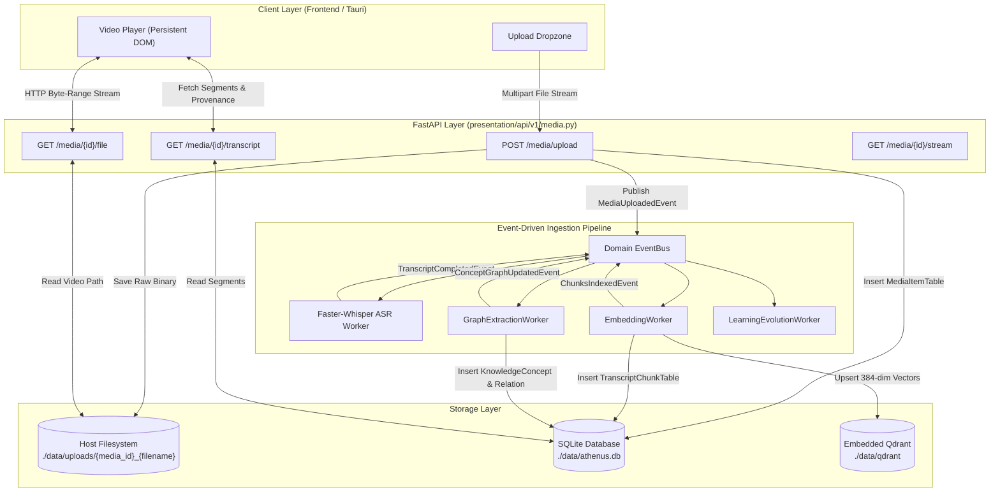
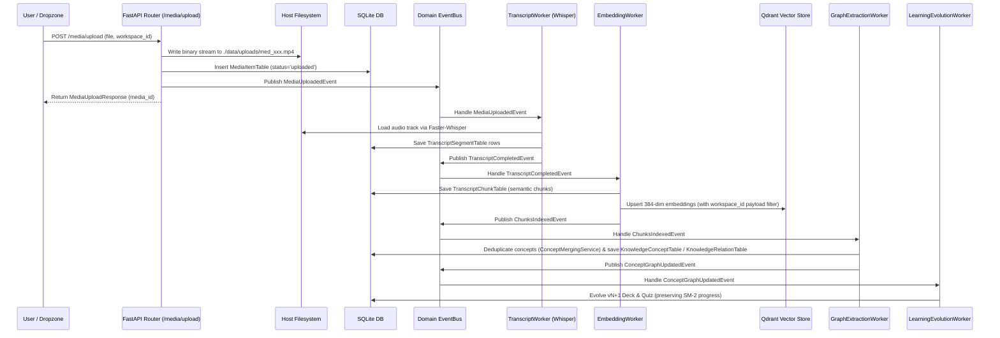

# MEDIA_STORAGE_ARCHITECTURE.md — Media Storage & Video Lifecycle Architecture

This document provides a comprehensive architectural specification of the **Media Storage Architecture and Video Lifecycle** in **Athenus**. It documents how video/audio assets flow from initial upload to AI ingestion, transcript chunking, vector indexing, knowledge graph extraction, active recall generation, and eventual factory reset.

---

## 1. Executive Summary & Media Storage Topology

Athenus follows an **Immutable Source Media / Mutable Derived Artifact** architectural pattern. Raw binary video files are written to the host filesystem as un-mutated source files, while metadata, transcript segments, vector embeddings, concept nodes, and active recall study decks are stored as relational structures in SQLite (`./data/athenus.db`) and vector structures in Qdrant (`./data/qdrant`).



---

## 2. Physical File Storage & Directory Structure

### 2.1 File Location Strategy
- **Path**: `./data/uploads/{media_id}_{filename}` (configured via `settings.UPLOADS_DIR`).
- **Naming Protocol**: Deterministic prefixing using a 32-bit hex UUID (`med_a1b2c3d4_{original_name}`). This guarantees zero filename collision on disk even if two lecture files share identical names across different workspaces.
- **Immutability**: Source files in `./data/uploads/` are write-once read-many (WORM). They are never mutated, re-encoded, or altered by AI ingestion workers.

### 2.2 Shared Mount Topology (Containerized vs Native)
- In Docker environments (`docker-compose.yml`), `./data` is mounted as a shared host volume (`./data:/app/data`).
- Both web backend containers (`athenus-backend`) and native desktop sidecars read/write to the exact same physical disk path, ensuring seamless switching between web and Tauri desktop runtimes.

---

## 3. Database Metadata & Workspace Scoping

### 3.1 `MediaItemTable` Relational Schema
Stored canonically in SQLite (`athenus.db`) via `SQLModel` / `SQLAlchemy` ORM:

```sql
CREATE TABLE media_items (
    id VARCHAR PRIMARY KEY,                  -- e.g. "med_a1b2c3d4"
    workspace_id VARCHAR NOT NULL,          -- Belongs strictly to 1 workspace
    title VARCHAR NOT NULL,                 -- Display title or original filename
    file_path VARCHAR NOT NULL,             -- Absolute host disk path
    media_type VARCHAR DEFAULT 'video',     -- 'video' | 'audio'
    file_size_bytes BIGINT DEFAULT 0,       -- Byte count of source upload
    duration_seconds FLOAT DEFAULT 0.0,     -- Audio duration parsed during ASR
    status VARCHAR DEFAULT 'pending',       -- 'pending' | 'uploaded' | 'processing' | 'completed' | 'failed'
    error_message VARCHAR,                  -- Telemetry failure log if ingestion fails
    created_at DATETIME DEFAULT CURRENT_TIMESTAMP,
    updated_at DATETIME DEFAULT CURRENT_TIMESTAMP
);
CREATE INDEX ix_media_items_workspace_id ON media_items (workspace_id);
```

### 3.2 Workspace Isolation Rules
- A `MediaItemTable` record is bound strictly to a single `workspace_id`.
- The `WorkspaceService` updates `WorkspaceTable.media_item_ids` (stored as a JSON string array) to track workspace membership.
- All media query endpoints (`GET /api/v1/media/{id}/transcript`, `/file`, `/status`) validate that the requested media ID belongs to the active `workspace_id`, preventing cross-workspace leakage.

---

## 4. End-to-End Video Processing & Ingestion Pipeline



---

## 5. Derived Artifact Association & Grounding Provenance

Every derived learning artifact maintains explicit **Grounding & Provenance** references back to the source media item and timestamp interval:

```
[Raw Video File on Disk]
       ▲
       │ file_path
[MediaItemTable (media_id)]
       ▲
       │ media_id + timestamp intervals (start_time, end_time)
 ┌─────┴─────────────────────────┬───────────────────────────────┐
 │                               │                               │
[TranscriptSegmentTable]  [TranscriptChunkTable]     [KnowledgeConceptTable]
                                 │                               │
                                 ▼                               ▼
                      [Embedded Qdrant Vector]      [Flashcards & Quiz Questions]
```

### Provenance Schema Contract
All concept nodes, flashcards, and quiz questions store four explicit provenance columns:
1. `media_id`: Primary key of the originating lecture video.
2. `source_chunk_ids`: JSON string array of contributing `TranscriptChunkTable` IDs.
3. `start_time`: Float timestamp (in seconds) marking start of explanation in the video.
4. `end_time`: Float timestamp (in seconds) marking end of explanation in the video.

### Instant Jump-To-Source Execution
When a user clicks a timestamp badge (`⏱ 03:45`) in the Knowledge Graph inspector, Flashcard view, or Quiz studio:
1. Frontend dispatches `setActiveMediaId(card.media_id)`.
2. Frontend sets `setTargetSeekSeconds(card.start_time)`.
3. Application routes view to `view-video`.
4. Video player seeks directly to `card.start_time` and begins playback.

---

## 6. Media Serving & Player Architecture

### 6.1 Backend Media Serving Endpoint
- **URL**: `GET /api/v1/media/{media_id}/file?workspace_id=...`
- **Implementation**: Uses FastAPI's `FileResponse`, supporting HTTP Range requests (`206 Partial Content`) for instant video scrubbing and playback seeking.
- **Validation**: Verifies file existence on host disk and checks workspace ownership match.

### 6.2 Zero DOM Re-Parenting Persistent Player
- To prevent browser Picture-in-Picture (PiP) detachments and audio glitches when navigating between tabs, `<VideoWorkspace />` is mounted inside a single persistent container in `DesktopShell.tsx`.
- Navigating away from `view-video` applies CSS `display: none` (`hidden`) without unmounting or reparenting the HTML5 `<video>` DOM node.

---

## 7. Media Deletion & Factory Reset Lifecycle

### 7.1 Single Media Asset Deletion (Standard Deletion)
Deleting a single media asset removes its raw file and dependent ingestion rows:
1. Unlinks raw binary file from `./data/uploads/`.
2. Purges related `TranscriptSegmentTable`, `TranscriptChunkTable`, and `ProcessingLogTable` rows.
3. Removes `media_id` from `Qdrant` vector store payloads.
4. *Preservation Guarantee*: Concepts, Flashcards, and Quizzes derived from that video remain intact in the workspace knowledge model, but their provenance jump link indicates `Source video removed`.

### 7.2 System Clear Data (21-Table Factory Reset)
Invoking **CLEAR MY DATA** (`POST /api/v1/system/clear-data`) executes an atomic transaction that purges **100% of all data**:

```
1. FlashcardReviewTable      (Child)
2. FlashcardTable            (Child)
3. FlashcardDeckTable        (Child)
4. QuizAttemptTable          (Child)
5. QuizQuestionTable         (Child)
6. QuizTable                 (Child)
7. ConceptMasteryTable       (Child)
8. WorkspaceAnalyticsTable   (Child)
9. StudySessionTable         (Child)
10. ConceptAliasTable        (Child)
11. KnowledgeRelationTable   (Child)
12. KnowledgeConceptTable    (Child)
13. ArtifactJobTable         (Child)
14. ChatMessageTable         (Child)
15. ChatSessionTable         (Child)
16. TranscriptSegmentTable   (Child)
17. TranscriptChunkTable     (Child)
18. ProcessingLogTable       (Child)
19. MediaItemTable           (Parent - Unlinks all files in ./data/uploads/)
20. WorkspaceTable           (Parent - Re-initialized to clean "default" workspace)
21. SystemSettings           (Parent - Reset to defaults)
```
- Drops and re-creates Qdrant vector collection `transcript_chunks`.
- Empties in-memory snapshot stores.

---

## 8. Architectural Evaluation

### 8.1 Strengths
1. **Local-First & Storage Efficient**: Storing raw media on disk while maintaining lightweight metadata in SQLite keeps database file sizes under a few megabytes even for hundreds of hours of lecture content.
2. **Immutable Provenance Traceability**: Every AI card, question, and chat citation points back to exact timestamp intervals in source videos.
3. **Resilient Offline Fallbacks**: If LLMs or vector stores are offline, heuristic extractors and SQLite text search maintain core video playback and transcript functionality.
4. **Zero-Detachment Media Shell**: Prevents DOM re-parenting glitches during multi-tab study sessions.

### 8.2 Weaknesses & Bottlenecks
1. **Synchronous File Upload Stream**: Large 2GB+ video files stream directly through FastAPI memory/disk handlers before background ASR starts. Streaming directly to a temp spooler with chunked resume support would improve upload UX.
2. **Host File Path Dependency**: `MediaItemTable.file_path` stores absolute host disk paths (e.g. `E:\repos\athenus\data\uploads\...`). If a user moves the repository directory, video playback returns a 404 until paths are resolved. Relative path normalization is recommended.
3. **No Automatic Transcript Re-indexing on Audio Editing**: If raw video is replaced or edited externally, transcript segments must be manually re-processed.

### 8.3 Opportunities for Improvement
- **Relative Path Resolution**: Store relative paths (e.g., `uploads/med_xxx.mp4`) in `MediaItemTable` and resolve dynamically relative to `settings.DATA_DIR`.
- **HLS / DASH Video Transcoding**: For very long 4K lectures, optional background HLS segmenting would improve seeking performance on low-spec hardware.
