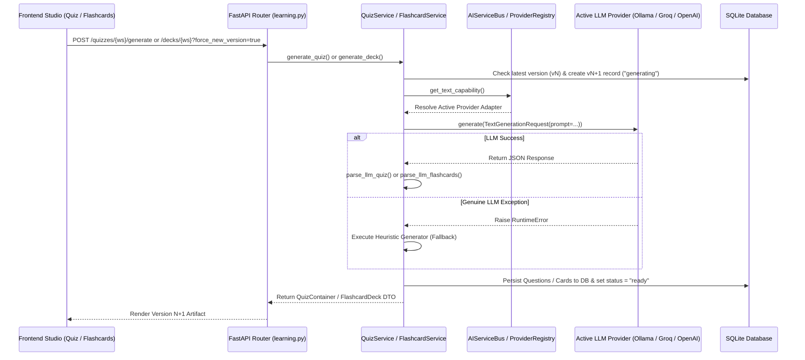

# Quiz and Flashcard Generation & Regeneration Architecture

This document serves as the canonical architectural specification for the AI-driven **Quiz** and **Flashcard** generation and regeneration pipelines in Athenus Knowledge OS.

---

## Overview

- **LLM-First Architecture with Rule-Based Heuristic Fallbacks**: Both Quiz and Flashcard generation prioritize LLM capabilities via `AIServiceBus`. If LLM execution raises a genuine exception (e.g. provider offline or network failure), the system executes a concept-grounded heuristic fallback generator.
- **Local-First Timeout Policy**: Text generation POST requests to local models (e.g. Ollama `llama3:8b`) operate without artificial wall-clock read timeouts (`httpx.Timeout(timeout=None, connect=10.0)`), allowing local inference to run to completion while protecting TCP connection establishment with a 10s timeout.
- **Error Integrity**: Provider adapters log explicit errors and raise `RuntimeError` exceptions rather than returning fake fallback text strings. Heuristic fallbacks execute only upon explicit exceptions.
- **Immutable Versioned Regeneration (`v1` → `v2` → `vN`)**: Regeneration (`force_new_version=True`) creates a new database record with an independent identity (`quiz_{ws}_vN+1` / `deck_{ws}_vN+1`), preserving all prior versions and user review/grading histories intact.

---

## Architecture File References

| Subsystem | Concern | File Path | Key Functions / Classes |
| :--- | :--- | :--- | :--- |
| **Quiz** | Prompt Template & Builder | `backend/app/domain/learning/quiz_generation.py` | `build_quiz_prompt()` |
| **Quiz** | JSON Response Parser | `backend/app/domain/learning/quiz_generation.py` | `parse_llm_quiz()` |
| **Quiz** | Heuristic Fallback Engine | `backend/app/domain/learning/quiz_generation.py` | `generate_quiz_heuristic()` |
| **Quiz** | LLM Generation & Persistence | `backend/app/domain/learning/quiz_service.py` | `QuizService.generate_quiz()`, `_generate_with_llm()` |
| **Flashcard** | Prompt Template & Builder | `backend/app/domain/learning/flashcard_generation.py` | `build_flashcard_prompt()` |
| **Flashcard** | JSON Response Parser | `backend/app/domain/learning/flashcard_generation.py` | `parse_llm_flashcards()` |
| **Flashcard** | Heuristic Fallback Engine | `backend/app/domain/learning/flashcard_generation.py` | `generate_flashcards_heuristic()` |
| **Flashcard** | LLM Generation & Persistence | `backend/app/domain/learning/flashcard_service.py` | `FlashcardService.generate_deck()`, `_generate_with_llm()` |
| **Routing** | AI Capability Dispatcher | `backend/app/domain/ai/service_bus.py` | `AIServiceBus.get_text_capability()` |
| **Routing** | Active Provider Resolver | `backend/app/domain/ai/provider_registry.py` | `LLMProviderRegistry.get_active_provider()` |
| **Adapter** | Local Ollama Adapter | `backend/app/infrastructure/adapters/ollama_adapter.py` | `OllamaTextGenAdapter` |
| **Adapter** | Cloud OpenAI-Compatible Adapter | `backend/app/infrastructure/adapters/openai_compatible_adapter.py` | `OpenAICompatibleProviderAdapter` |

---

## Generation & Regeneration Pipelines



---

## Model Resolution Strategy

Model selection is determined dynamically by the active provider configured in Settings:

- **Local Provider (Ollama)**: Base URL `http://localhost:11434`, default model `llama3:8b`. Overridable at runtime via SQLite settings (`selected_ollama_model`).
- **Cloud Providers**: Registered in `main.py` and selected via Settings (`default_llm`):
  - **Groq**: `llama-3.3-70b-versatile`
  - **OpenRouter**: `google/gemini-2.5-flash`
  - **OpenAI**: `gpt-4o-mini`
  - **Anthropic**: `claude-3-5-sonnet-latest`

---

## Generation Prompt Specifications

### 1. Quiz Prompt (`quiz_generation.py`)
```text
You are a comprehension-quiz author for an educational video transcript.

Create {max_questions} novel, concept-balanced Quiz Version {version} comprehension questions that are:
- Grounded in the provided concepts and transcript chunks (distractors must be plausible but incorrect).
- Formulated from fresh angles (e.g. application scenarios, analytical relationships, or key definitions).
- Answerable ONLY from the transcript material.

Respond with ONLY a JSON object in exactly this shape:
{
  "questions": [
    {
      "question_text": "...",
      "options": ["A", "B", "C", "D"],
      "correct_index": 1,
      "explanation": "...",
      "concept": "Concept Name",
      "source_chunk_ids": ["chunk_0"]
    }
  ]
}

Extracted concepts:
{concept_blob}

Transcript chunks:
{chunk_blob}
```

### 2. Flashcard Prompt (`flashcard_generation.py`)
```text
You are a spaced-repetition flashcard author for an educational video transcript.

Generate high-quality flashcards from the extracted concepts and transcript chunks below.
Create a balanced mix of card types: "basic" (front/back Q&A), "cloze" (fill-in-the-blank statement with {{c1::answer}}), "definition" (term -> concise definition), and "true_false" (statement requiring true/false, with options ["True", "False"]).

Rules:
- Every card MUST be grounded in the provided concepts and chunks.
- Include "concept" matching one of the provided concept names, and reference "source_chunk_ids" exactly as given.

Respond with ONLY a JSON object in exactly this shape:
{
  "cards": [
    {"card_type": "basic", "front": "...", "back": "...", "concept": "Concept Name", "source_chunk_ids": ["chunk_0"]},
    {"card_type": "cloze", "cloze_text": "Statement with {{c1::answer}}", "back": "Explanation", "concept": "Concept Name", "source_chunk_ids": ["chunk_0"]},
    {"card_type": "definition", "front": "Term", "back": "Definition", "concept": "Concept Name", "source_chunk_ids": ["chunk_0"]},
    {"card_type": "true_false", "front": "Statement", "back": "True or False", "options": ["True", "False"], "concept": "Concept Name", "source_chunk_ids": ["chunk_0"]}
  ]
}

Extracted concepts:
{concept_blob}

Transcript chunks:
{chunk_blob}
```

---

## Structured Output & Post-Hoc Parsers

- **Contract Enforcement**: Enforced post-hoc via regex JSON match (`re.search(r"\{.*\}", text, re.DOTALL)`), `json.loads`, and structural validation.
- **Quiz Parser (`parse_llm_quiz`)**: Validates `question_text`, minimum 2 options, clamps `correct_index`, maps to `ExtractedQuestion`.
- **Flashcard Parser (`parse_llm_flashcards`)**: Validates `card_type` in `{"basic", "cloze", "definition", "true_false"}`, validates non-empty front/back, maps to `ExtractedFlashcard`.
- **Dispatch Parameters**:
  - Quiz: `temperature=0.3`, `max_tokens=2048`
  - Flashcards: `temperature=0.4`, `max_tokens=2048`

---

## Regeneration Context Rotation & Variation

When `force_new_version=True` is supplied:

1. **Version Increment**: Computes `version = latest + 1` from `QuizTable` / `FlashcardDeckTable`.
2. **Concept & Chunk Rotation**:
   - Computes concept coverage across all prior versions via `_concept_coverage()`.
   - Ranks concepts by `(coverage, name)` and selects top concepts.
   - Rotates transcript chunks by a version-based offset `(version - 1) % len(chunks)`.
3. **Independent Generation**: Executes a fresh LLM call via `_generate_with_llm()`, persisting the resulting items under the new version ID (`quiz_{ws}_vN+1` / `deck_{ws}_vN+1`).
