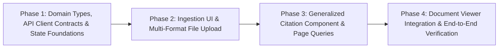

# Implementation Plan — Frontend Integration for Generalized Document & PDF Ingestion Architecture

This implementation plan defines the step-by-step frontend execution roadmap to integrate the **Generalized Document and PDF Ingestion Architecture** into the Athenus frontend.

The backend implementation (documented in [walkthrough.md](file:///e:/repos/athenus/walkthrough.md) and [ADR 0021](file:///e:/repos/athenus/docs/adr/0021-generalized-document-pdf-ingestion-architecture.md)) is complete. This plan specifies the minimal, clean, non-breaking frontend updates required to consume the new backend capabilities.

---

## User Review Required

> [!IMPORTANT]
> **Zero Video Regression Guarantee**: Existing video workflows (video uploads, video player seeking, `⏱ MM:SS` timestamp citation clicks, PiP detachment prevention) must remain 100% operational with zero regressions.

> [!IMPORTANT]
> **Phase Execution Gate**: Each phase must be implemented, type-checked, and validated against its corresponding **Manual Validation / QA Matrix** before proceeding to the subsequent phase.

---

## Proposed Changes

### Component 1: Domain Types & API Client Contracts

#### [MODIFY] [chatService.ts](file:///e:/repos/athenus/frontend/src/services/chatService.ts)
- Extend `BackendCitationDTO` schema:
  - Add optional fields: `source_type?: 'video' | 'pdf'`, `page_number?: number | null`, `section_title?: string | null`, `location?: Record<string, any> | null`.
- Extend `sendChatQuery`:
  - Accept parameters: `documentId?: string`, `sourceType?: 'video' | 'pdf'`, `currentPage?: number`.
  - Pass `document_id`, `source_type`, and `current_page` in JSON body payload to `POST /api/v1/chat/query`.
- Update `mapBackendCitations`:
  - Map `sourceType`, `pageNumber`, `sectionTitle`, and `location` onto frontend `Citation` DTO objects.

#### [MODIFY] [types.ts](file:///e:/repos/athenus/frontend/src/features/chat/types.ts)
- Extend `Citation` interface:
  - Add `sourceType?: 'video' | 'pdf'`, `pageNumber?: number`, `sectionTitle?: string`, `location?: Record<string, any>`.

#### [MODIFY] [workspaceContext.ts](file:///e:/repos/athenus/frontend/src/types/workspaceContext.ts)
- Extend `WorkspaceContext` interface:
  - Add `documentId?: string | null`, `sourceType?: 'video' | 'pdf'`, `currentPage?: number | null`.

---

### Component 2: Global State Management (Zustand Store)

#### [MODIFY] [useAppStore.ts](file:///e:/repos/athenus/frontend/src/store/useAppStore.ts)
- Add active source context state variables to `UISlice`:
  - `activeDocumentId: string | null`
  - `activeSourceType: 'video' | 'pdf'`
  - `currentPage: number | null`
  - `targetPage: number | null`
- Add actions:
  - `setActiveDocumentId: (id: string | null) => void`
  - `setActiveSourceType: (type: 'video' | 'pdf') => void`
  - `setCurrentPage: (page: number | null) => void`
  - `setTargetPage: (page: number | null) => void`

---

### Component 3: Ingestion UI & Multi-Format File Upload Support

#### [MODIFY] [UploadDropzone.tsx](file:///e:/repos/athenus/frontend/src/features/ingestion/UploadDropzone.tsx)
- Update `<input type="file">` element `accept` attribute:
  - `accept="video/*,audio/*,.pdf,.docx,.pptx,.xlsx,.epub,.md,.txt,application/pdf"`
- Update header and drag-and-drop user copy:
  - Header: `"Upload video, audio, or document learning materials to extract transcripts and index vector embeddings."`
  - Subtext: `"Supports MP4, MKV, MP3, PDF, DOCX, PPTX, XLSX, EPUB, TXT (Up to 100MB)"`

#### [MODIFY] [useIngestion.ts](file:///e:/repos/athenus/frontend/src/features/ingestion/useIngestion.ts)
- Update `STAGE_INDEX_BY_NAME`:
  - Map `document_parsing: 0` and `ocr_processing: 1`.
- Update stage stepper mapping logic:
  - Dynamically render `"Parsing Document Structure (AnyDoc)"` for `document_parsing` stage.
  - Dynamically render `"Extracting Text from Scanned Pages (RapidOCR)"` for `ocr_processing` stage.

---

### Component 4: Chat Interface & Generalized Citation Rendering

#### [MODIFY] [ChatMessageItem.tsx](file:///e:/repos/athenus/frontend/src/features/chat/ChatMessageItem.tsx)
- Update citation rendering in assistant message bubbles:
  - Inspect `cit.sourceType`.
  - If `cit.sourceType === 'pdf'` or `cit.pageNumber` is present: Render interactive `📄 Page X (Section)` badge styled with `bg-accent/15 border-accent/40 text-accent`.
  - If `cit.sourceType === 'video'`: Render legacy `⏱ MM:SS` badge styled with `bg-secondary/15`.
- Update click handlers:
  - Video citation click: Seeks video player via `setTargetSeekSeconds(secs)` and sets view to `view-video`.
  - Document citation click: Sets `activeDocumentId`, calls `setTargetPage(pageNumber)`, and switches view to document reader workspace.

#### [MODIFY] [useChat.ts](file:///e:/repos/athenus/frontend/src/features/chat/useChat.ts)
- Inspect active source state (`activeSourceType`, `activeMediaId`, `activeDocumentId`, `currentTime`, `currentPage`) from `useAppStore`.
- Transmit `document_id`, `source_type`, and `current_page` to `sendChatQuery` whenever the active workspace context is a document.

---

### Component 5: Workspace Layout & Document Viewer Integration

#### [NEW] [DocumentViewer.tsx](file:///e:/repos/athenus/frontend/src/components/DocumentViewer.tsx)
- Implement a clean, responsive document viewer component for PDF/Markdown content.
- Features page navigation controls (Previous Page, Next Page, Page $N$ of $M$, Direct Jump input).
- Listens to `targetPage` state in `useAppStore` to automatically scroll/navigate to cited pages upon citation badge clicks.

#### [MODIFY] [VideoWorkspace.tsx](file:///e:/repos/athenus/frontend/src/features/video/VideoWorkspace.tsx)
- Read `activeSourceType` from `useAppStore`.
- Dynamically render `PersistentMediaPlayer` when `activeSourceType === 'video'`, or `DocumentViewer` when `activeSourceType === 'pdf'`.

#### [MODIFY] [LibraryGrid.tsx](file:///e:/repos/athenus/frontend/src/features/library/LibraryGrid.tsx)
- Update library asset cards to display document icons (`📄`) for document assets and video icons (`🎬`) for video assets.
- On card click, update `activeSourceType` accordingly (`'pdf'` vs `'video'`).

---

## Phased Execution Roadmap

---

### Phase 1: Domain Types, API Client Contracts & State Foundations

#### Objective
Update frontend domain types, API service contracts, and Zustand state store to support backend generalized document DTOs.

#### Tasks
1. Extend `BackendCitationDTO` and `sendChatQuery` parameters in `chatService.ts`.
2. Extend `Citation` interface in `types.ts`.
3. Extend `WorkspaceContext` in `workspaceContext.ts`.
4. Add document state variables (`activeDocumentId`, `activeSourceType`, `currentPage`, `targetPage`) and actions in `useAppStore.ts`.
5. Run TypeScript type checks (`npx tsc --noEmit`).

#### Phase 1 Manual Validation / QA Matrix
| Test | How to Conduct the Test | Expected Behaviour |
| :--- | :--- | :--- |
| **1. Citation DTO Mapping Test** | Map a mock PDF `BackendCitationDTO` (`source_type: "pdf"`, `page_number: 14`, `section_title: "Proof"`). | `mapBackendCitations` returns a `Citation` object preserving `sourceType: "pdf"` and `pageNumber: 14` without NaN errors. |
| **2. Video Citation Backward Compatibility Test** | Map a legacy video `BackendCitationDTO` (`start_time: 90.0`, `end_time: 120.0`). | Returns `Citation` object with formatted `startTime: "01:30"` and `endTime: "02:00"`. |

---

### Phase 2: Ingestion UI & Multi-Format File Upload Support

#### Objective
Allow users to upload PDFs and office documents through `UploadDropzone` and display accurate stage progression for `document_parsing` and `ocr_processing`.

#### Tasks
1. Update `<input type="file">` `accept` attribute in `UploadDropzone.tsx`.
2. Update drag-and-drop header and subtext copy.
3. Update `STAGE_INDEX_BY_NAME` and dynamic stage mapping in `useIngestion.ts`.
4. Run frontend build checks.

#### Phase 2 Manual Validation / QA Matrix
| Test | How to Conduct the Test | Expected Behaviour |
| :--- | :--- | :--- |
| **1. PDF File Selection Test** | Open the Upload view (`view-ingestion`) and select a local PDF file in the file picker. | The UI accepts the file, displays `Selected: filename.pdf`, and enables the upload button. |
| **2. Document Stage Stepper Test** | Trigger an ingestion job emitting `stage: "document_parsing"` or `stage: "ocr_processing"`. | The status monitor highlights the active stage with correct progress percentage without falling back to `N/A`. |

---

### Phase 3: Generalized Citation Component & Page-Aware Chat Queries

#### Objective
Generalize citation rendering in chat messages to display interactive `📄 Page X` badges for documents, and update `useChat` to transmit active document context parameters (`document_id`, `source_type`, `current_page`) to the backend.

#### Tasks
1. Update citation badge rendering in `ChatMessageItem.tsx` to branch on `sourceType === 'pdf'`.
2. Implement `handleDocumentCitationClick` to trigger `setTargetPage(pageNumber)` and switch view.
3. Update `useChat.ts` to transmit document parameters to `sendChatQuery`.
4. Run frontend build checks.

#### Phase 3 Manual Validation / QA Matrix
| Test | How to Conduct the Test | Expected Behaviour |
| :--- | :--- | :--- |
| **1. PDF Citation Badge Rendering Test** | Send a chat question about an ingested document. | The assistant message renders a `📄 Page X (Section)` badge instead of a `⏱` timestamp badge. |
| **2. Video Citation Regression Test** | Send a chat question about a video asset and click a `⏱ MM:SS` citation. | The video player seeks to `MM:SS` and resumes playback without error. |

---

### Phase 4: Document Viewer Integration & End-to-End Verification

#### Objective
Provide a clean workspace view for reading documents and receiving page jump navigation triggers when clicking document citations.

#### Tasks
1. Create `DocumentViewer.tsx` component supporting page navigation and target page scrolling.
2. Update `VideoWorkspace.tsx` layout to switch dynamically between `PersistentMediaPlayer` and `DocumentViewer`.
3. Update asset cards in `LibraryGrid.tsx` with modality icons (`🎬` vs `📄`).
4. Run complete frontend build (`npm run build` in `frontend/`).

#### Phase 4 Manual Validation / QA Matrix
| Test | How to Conduct the Test | Expected Behaviour |
| :--- | :--- | :--- |
| **1. End-to-End Document Citation Jump Test** | Click a `📄 Page 14` citation badge in a chat response. | The active view switches to the document viewer, navigates directly to Page 14, and highlights the target section. |
| **2. Dual Modality Workspace Switching Test** | Switch between a video asset and a PDF document asset in the Library grid. | The workspace seamlessly toggles between the Video Player view and Document Reader view without state corruption. |
