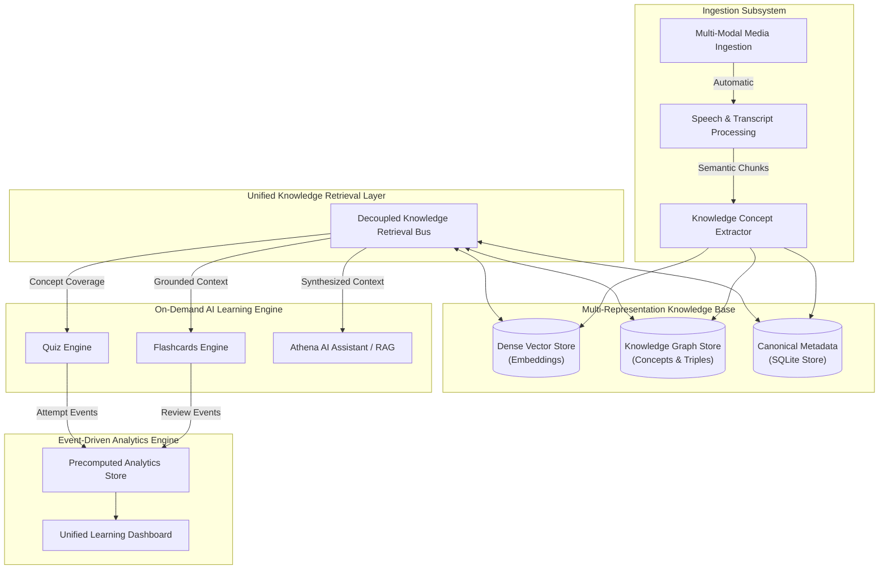

# Master Architecture Plan — Athenus AI Knowledge & Retrieval Platform

This document outlines the strategic architecture for **Athenus** as an open-source, local-first **AI Knowledge & Learning OS**. 

It transforms the functional gaps identified in `docs/GAP_ANALYSIS.md` (§9) into a cohesive, decoupled, and extensible AI engineering platform.

---

## 🏛️ System Architecture Intent & Topology



---

## 🔍 The Unified Knowledge Retrieval Foundation

A central goal of this architecture is establishing a **reusable, model-agnostic Knowledge Retrieval Foundation** that serves current learning features (Flashcards, Quizzes, Graphs, Analytics) and future AI agent capabilities without tight coupling.

### 1. Multi-Representation Knowledge Coexistence
Rather than forcing all information into a single vector database or graph format, the system maintains **four complementary knowledge representations**:

| Representation Layer | Role & Strengths | Primary Retrieval Pattern |
|---|---|---|
| **Dense Vector Store** | Fine-grained semantic similarity over raw transcript text chunks. | Cosine / Similarity Top-K Search |
| **Knowledge Graph Topology** | High-level conceptual dependencies, prerequisites, and domain entity structures. | Graph Traversal, N-Hop Neighbors, Shortest Path |
| **Canonical Relational Metadata** | Structured state, time-series events, study history, and workspace scopes. | SQL Relational & Indexed Queries |
| **Learning Artifact Memory** | Versioned Flashcard decks, Quiz diagnostic attempts, and Concept Mastery scores. | Key-Value / Filtered Range Queries |

### 2. Decoupled Retrieval Interface (`KnowledgeRetrievalBus`)
Application capabilities (Chat, Flashcards, Quizzes, Agents) do NOT invoke raw database queries or vector stores directly. They query an abstract **Retrieval Bus** that orchestrates hybrid retrieval strategies across representations.

### 3. Traceability, Grounding & Provenance Contract
Every AI-generated artifact (Flashcard, Quiz Question, Concept Node, Assistant Answer) MUST adhere to a strict **Grounding Contract**:

```json
{
  "artifact_id": "card_9a8b7c6d",
  "concept_id": "concept_backpropagation",
  "source_provenance": {
    "media_id": "med_12345678",
    "chunk_ids": ["chunk_12", "chunk_13"],
    "start_time": 745.2,
    "end_time": 810.0
  },
  "generation_metadata": {
    "model_provider": "ollama",
    "model_name": "llama3.2",
    "prompt_version": "v1.2",
    "confidence_score": 0.92
  }
}
```

This guarantees that **100% of generated content remains clickable, observable, and jump-navigable** back to exact media playback timestamps.

---

## ⚖️ Architectural Trade-off Evaluation

| Decision Area | Option A (Chosen / Preferred) | Option B (Alternative) | Architectural Trade-off & Rationale |
|---|---|---|---|
| **Artifact Generation** | **On-Demand with Permanent Caching** | Automatic Background Generation on Upload | **Trade-off**: On-demand reduces LLM token consumption and compute load during video ingestion, deferring heavy generation until explicit user interaction. |
| **Concept Merging** | **Incremental Hybrid Deduplication** | Static Direct Insertion per Video | **Trade-off**: Incremental merging requires vector distance and alias resolution logic, but prevents graph fragmentation across multiple video uploads. |
| **Analytics Read Model** | **Event-Driven Precomputed Tables** | Real-Time Dynamic SQLite Aggregation | **Trade-off**: Precomputed tables require maintaining write-path event subscribers, but guarantee constant-time $O(1)$ dashboard load latency as database size grows. |
| **Artifact History** | **Immutable Versioning (`v1`, `v2`)** | Overwrite In-Place on Regeneration | **Trade-off**: Versioning consumes small additional storage rows, but preserves human review history (SM-2 retention schedules) and enables audit comparison across LLM runs. |

---

## 📋 Milestone & Phase Specifications

### Milestone 1: Knowledge Graph & Entity Consolidation (`view-graph`)

Establish the core concept network with incremental entity deduplication, expanded traversal APIs, and interactive UI.

#### Phase 1.1: Canonical Concept Schema & Incremental Deduplication Engine
- Define workspace-scoped concept entities and relationship models in relational storage.
- Implement an **Incremental Concept Merging Service**:
  - Exact string normalization & alias mapping.
  - Semantic vector similarity evaluation to detect near-duplicate entities.
  - Merges duplicate entities into canonical concepts while preserving directional relation links.

#### Phase 1.2: Event-Driven Graph Extraction Pipeline
- Implement a background worker listening to transcript completion events.
- Extracts domain concepts and directional relationships using model capability interfaces, passing candidates through the merging engine.
- Emits real-time artifact status updates (`pending` $\rightarrow$ `generating` $\rightarrow$ `ready` $\rightarrow$ `failed`).

#### Phase 1.3: Expanded Graph Retrieval APIs
- Expose REST endpoints:
  - `GET /api/v1/graph/workspace/{workspace_id}`: Topology, nodes, edges, artifact lifecycle state.
  - `GET /api/v1/graph/concepts/search`: Hybrid keyword and semantic concept search.
  - `GET /api/v1/graph/concepts/{concept_id}/neighbors`: N-hop graph traversal.
  - `GET /api/v1/graph/concepts/shortest-path`: Prerequisite dependency resolution.

#### Phase 1.4: Interactive Canvas & Inspector UI
- Build an interactive SVG/Canvas graph UI with zoom/pan controls, concept search, prerequisite path highlighting, and a concept inspector sidebar displaying linked lecture timestamps.

---

### Milestone 2: Active Recall & Spaced Repetition Studio (`view-flashcards`)

On-demand concept-grounded flashcard generation, deck versioning, SuperMemo-2 (SM-2) engine, and Anki export.

#### Phase 2.1: Multi-Type Flashcard Schema & Immutable Deck Versioning
- Add relational models for Deck Containers (`version`, `status`), Flashcards (`card_type`, `concept_id`, `front`, `back`, `cloze_text`), and Review Logs (`rating`, `reviewed_at`).
- Schema support for multiple card types (`basic`, `cloze`, `definition`, `true_false`).

#### Phase 2.2: On-Demand Generator & Spaced Repetition Engine
- Implement SuperMemo-2 (SM-2) algorithm updating Ease Factors ($EF$), review intervals, and due dates based on human rating signals (1-4).
- On-demand generation service querying Knowledge Graph concepts, invoking LLM capabilities, and saving new deck versions (`v1`, `v2`) without overwriting historical review schedules.

#### Phase 2.3: Anki Exporter
- Service formatting active deck versions into standard Anki `.apkg` or CSV export formats.

#### Phase 2.4: Interactive Flashcard Studio UI
- Implement flashcard UI with deck version selector, 3D card flip animation, Cloze/Basic rendering, SM-2 rating buttons, queue progress indicators, and timestamp citation links.

---

### Milestone 3: Concept-Balanced Adaptive Quiz Studio (`view-quiz`)

Concept-balanced diagnostic quiz generation, versioning, diagnostic feedback, and error remediation.

#### Phase 3.1: Quiz Schema & Attempt History Persistence
- Relational schema for Quiz Containers, Questions (`concept_id`, `options`, `correct_index`, `explanation`), and Quiz Attempts (`score`, `answers`, `time_taken`).

#### Phase 3.2: Concept-Balanced Quiz Generation & Diagnostic Engine
- Generator service sampling questions proportionally across Knowledge Graph concept topology to ensure balanced assessment.
- Submission grading service recording attempts, calculating scores, and updating concept mastery levels.

#### Phase 3.3: Interactive Quiz Studio UI
- Quiz Studio UI with version selector, timed test runner, diagnostic scorecard, concept weakness breakdown, and clickable video timestamp jump links.

---

### Milestone 4: Learning Analytics & Unified Pipeline (`view-analytics`)

Precomputed analytics infrastructure, active study session tracking, concept mastery matrix, and unified learning pipeline UI.

#### Phase 4.1: Precomputed Analytics & Active Study Telemetry
- Schema for `WorkspaceAnalyticsTable`, `ConceptMasteryTable`, and `StudySessionTable` (measuring active user engagement duration).
- Event subscribers updating precomputed metrics on review, quiz attempt, and study session events.

#### Phase 4.2: Analytics REST APIs & Concept Mastery Service
- Read-optimized REST endpoints (`/api/v1/analytics/overview`, `/api/v1/analytics/mastery`).
- Service producing targeted revision recommendations based on concept mastery scores.

#### Phase 4.3: Unified Learning Pipeline UI
- Build top **Unified Learning Pipeline Progress Bar** showing workspace progression: `Ingestion` $\rightarrow$ `Graph` $\rightarrow$ `Flashcards` $\rightarrow$ `Quiz` $\rightarrow$ `Mastery` $\rightarrow$ `Recommendations`.
- Replace 🚧 "Under Construction" placeholder in application shell with production Analytics Dashboard.

---

## 🧪 Verification & Quality Criteria

### 1. Architectural Contract Verification
- **Workspace Isolation**: Automated test suites verifying 0% cross-workspace leak across vector, graph, relational, and analytics queries.
- **Traceability Guarantee**: 100% of generated concept nodes, flashcards, and quiz questions must pass automated schema validation confirming non-null `start_time`, `end_time`, and `media_id` citations.

### 2. Automated Test Coverage
- `pytest tests/test_knowledge_graph.py`: Entity resolution, deduplication engine, and traversal endpoints.
- `pytest tests/test_learning_tools.py`: On-demand generation, versioning, SM-2 calculations, and concept-balanced sampling.
- `pytest tests/test_analytics.py`: Event-driven precomputed updates and active study session heartbeats.

---

## 🔬 AI Engineering Principles & Framework Mapping

| Milestone & Phase | Core Capability | AI Engineering Principle | Architectural Pattern & Intent |
|---|---|---|---|
| **M1: Graph (P1.1-P1.2)** | Concept Deduplication | **Entity Resolution & Knowledge Normalization** | Hybrid vector-distance and alias clustering preventing graph node explosion across multi-video workspaces. |
| **M1: Graph (P1.3)** | Graph Traversal APIs | **Multi-Representation Retrieval Layer** | Graph-augmented retrieval (`neighbor`, `shortest_path`) coexisting with dense vector search to provide high-level structural context. |
| **M1: Graph (P1.4)** | Concept Inspector | **Traceability & Provenance Contract** | Unbroken evidence chain linking high-level concept nodes back to raw transcript chunks and exact media playback timestamps. |
| **M2: Flashcards (P2.1)** | On-Demand Lazy Generation | **Compute Efficiency & Cost Awareness** | Defers heavy LLM generation until explicit user request, avoiding wasted tokens during passive media ingestion. |
| **M2: Flashcards (P2.1)** | Deck Versioning (`v1`, `v2`) | **Immutable Artifact Versioning & Lineage** | Treats AI outputs as versioned snapshots, preserving human review feedback (SM-2 schedules) across model regenerations. |
| **M2: Flashcards (P2.2)** | SM-2 Spaced Repetition | **Human-in-the-Loop Active Feedback** | Dynamic feedback loop where human retention signals drive algorithmic learning schedules. |
| **M3: Quiz (P3.1-P3.2)** | Concept-Balanced Sampling | **Coverage-Driven Generation** | Graph-guided sampling selecting evaluation items proportionally across domain concept topology. |
| **M3: Quiz (P3.3)** | Diagnostic Feedback Engine | **Self-Correcting Error Remediation** | Distractor rationale explanations paired with video timestamp citations for automated error remediation. |
| **M4: Analytics (P4.1)** | Precomputed Read Tables | **Decoupled Event-Driven CQRS** | Decouples write-heavy AI event processing from read-heavy UI dashboard queries via precalculated aggregates. |
| **M4: Analytics (P4.2-P4.3)**| Unified Pipeline View | **End-to-End AI Lifecycle Orchestration** | Holistic user-facing representation of the AI learning lifecycle, guiding users through Ingestion $\rightarrow$ Graph $\rightarrow$ Recall $\rightarrow$ Diagnostic Assessment $\rightarrow$ Mastery. |
